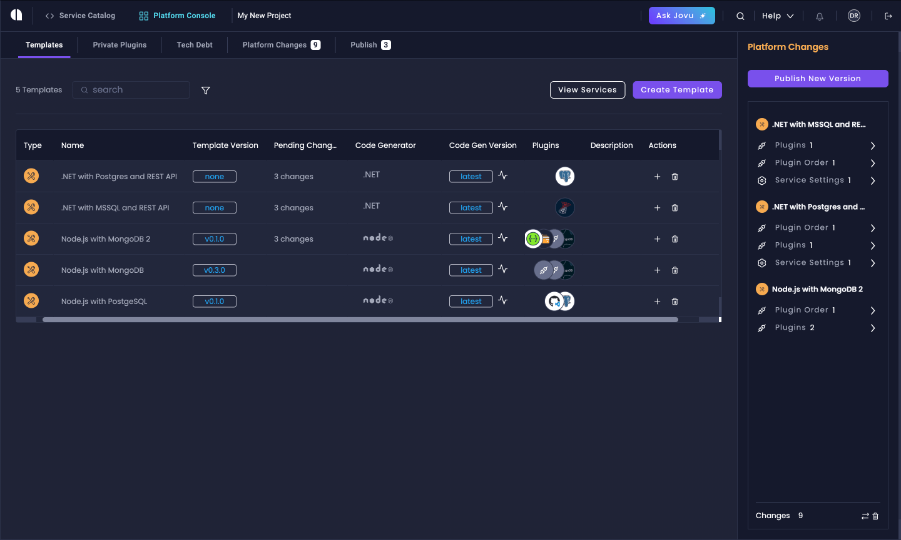

# Platform Console

The **Platform Console** is a powerful feature in Amplication that provides a centralized hub for managing platform-wide features and configurations. It allows your team to oversee and maintain standardized practices across your services and projects.

## Overview

The Platform Console introduces several key tabs:

1. [**Live Service Templates**](/live-service-templates): Pre-configured templates that serve as a foundation for creating and maintaining standardized services that follow your organization's best practices.
2. [**Private Plugins**](/private-plugins/): Custom plugins visible only to your organization that can be added to templates or services to extend functionality and enforce your organization's standards.
3. **Technical Debt Management**: Centralized tracking and resolution template and plugin changes across all your services.
4. **Platform Changes**: In-depth overview of all changes made to templates and plugins since their last published versions.
5. **Publish**: Version control and publish management for template and plugin updates.

These tabs are managed through a dedicated Platform Console dashboard, separate from the Service Catalog.

## Benefits

- **Standardization**: Ensure all services follow organizational best practices and configurations with Live Service Templates and Private Plugins.
- **Efficiency**: Quickly create new services based on your templates.
- **Customization**: Create and use Private Plugins to tailor services to your organization's specific needs.
- **Smooth Maintenance**: Update multiple services from a single location. When you update a template, all services using that template can automatically get a PR with the required changes.
- **Technical Debt Prevention**: Implement evolving organization-wide best practices across all services through templates and private plugins, creating a scalable architecture that resists the accumulation of technical debt as your project grows.

## Platform Console Features

### Live Service Templates

Live Service Templates is a powerful feature that allows you to create, manage, and use standardized templates for your backend services. Key aspects include:

- **Template Creation**: Define reusable service templates with pre-configured settings and plugins.
- **Service Generation**: Quickly create new services based on your defined templates.
- **Template Management**: Edit and update templates, with the ability to propagate changes to services through automatic pull requests.

For detailed information on creating and using Live Service Templates, please refer to our [Live Service Templates](/live-service-templates) documentation.

### Private Plugins

[Private plugins](/private-plugins/) allow you to create custom functionality specific to your organization's needs. These can be added to services or used in templates. These plugins let you build secure, proprietary integrations and define your organization's standards. 

:::note
Creating and managing private plugins requires an Enterprise plan.
:::

To create a private plugin:

1. In the Platform Console dashboard, navigate to the "Private Plugins" section.
2. Click on "Create Private Repository".
3. Connect to your plugin repository and add your existing private plugins to the project.

### Technical Debt Management

The Technical Debt tab helps you track and manage accumulated technical debt across all your services. It provides a comprehensive grid view of services that may be using outdated templates or plugins.

For each service with technical debt, you can see:
- Alert type (template or plugin updates)
- Current version in use
- Latest available version
- Status (Active, Resolved, or Ignored)

When you click "View Details" for any alert, you'll be taken to that specific service's technical debt tab where you can:
- View detailed diffs comparing the old and new versions
- Upgrade to the latest version using the "Upgrade" button
- Choose to ignore specific updates
- Resolve technical debt by applying the changes and generating a new service version

Team members associated with affected services receive notifications about technical debt alerts, helping maintain up-to-date and consistent services across your organization.

### Platform Changes

The Platform Changes tab provides an in-depth overview of all modifications made to templates and plugins since their last published versions. You can:
- View detailed diffs of changes, such as plugin order updates or new plugin additions
- See the exact code changes that will be applied
- Review changes per template or plugin individually
- Track what's changed since the last publish

### Publish

The Publish tab allows you to manage version control for template and plugin updates. Key features include:

- Add version messages to describe your changes
- Choose between publishing all changes or individual updates
- Select version update type (major, minor, or patch)
- Publish changes with different version messages for different templates/plugins

:::note
Publishing a new version of a template or plugin doesn't automatically update services using them. Updates become available in the Technical Debt tab, where you can review and apply them to specific services.
:::

## Conclusion

The Platform Console enhances the maintainability of your backend services, ensures organizational standardization, reduces technical debt, and streamlines collaboration between platform and development teams.

:::tip
For any questions or issues related to the Platform Console, please join our [Discord community](https://discord.gg/amplication) for feedback and discussions.
:::