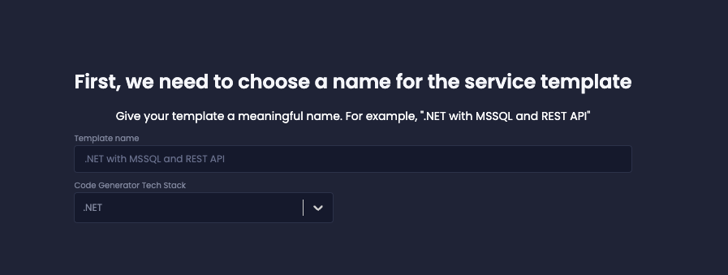

The **Platform Console** is a powerful new feature in Amplication that allows your team to define, manage, and maintain standardized templates and private plugins for their backend services.

:::note
The Platform Console features, including the usage of templates and creation of services based on templates, are **currently in beta**.
:::

## Overview

The Platform Console introduces two main components:

1. **Platform Console Templates**: Pre-configured service templates that serve as a blueprint for creating new services.
2. **Private Plugins**: Custom plugins visible only to your organization that can be added to templates or services to extend functionality and/or keep your organization's best practices and standards.

These components are managed through a new dashboard interface, separate from the existing services view.

## Benefits

- **Standardization**: Ensure all services follow organizational best practices and configurations.
- **Customization**: Create and use private plugins to tailor services to your organization's specific needs.
- **Efficiency**: Quickly create new services based on pre-defined templates.
- **Smooth Maintenance**: Update multiple services from a single location. When you update a template, all services using that template can automatically get a PR with the required changes.
- **Technical Debt Prevention**: Implement organization-wide best practices across all services through templates and private plugins, creating a scalable architecture that resists the accumulation of technical debt as your project grows.

## Platform Console Templates

Platform Console Templates allow you to create a single source of truth for your services' architecture. These templates can include:

- Pre-configured settings
- Standard plugins
- Custom private plugins

### Creating a Template

To create a new template:

1. Navigate to the Platform Console dashboard.
2. Click on "Create Template".
3. Provide a name for your template (e.g., "Node.js with PostgreSQL").
4. Select the desired components (e.g., Admin UI, GraphQL API, REST API).
5. Choose a database (e.g., PostgreSQL).
6. Click "Create" to finalize the template.

### Managing Templates

Managing and updating templates is very similar to updating individual services. You have access to the same settings and most of the options available for services, including:

- Viewing all templates in the Platform Console dashboard.
- Adding or removing plugins, including custom plugins.
- Renaming templates and updating their descriptions.

To edit a template:

1. Navigate to the Settings tab to update the configuration or the Plugins tab to install and update plugins.
2. Make your desired changes.
3. All changes are saved automatically.

<!-- :::note
When you update a template, **all services using that template will be updated in your next build**, ensuring consistency across your infrastructure.
:::
-->

### Using Templates

To create a new service based on a template:

1. Click on the "Add Resource" button.
2. Select "Service from Template" from the available options.
3. In the modal that appears, choose a specific service template.
4. Provide a name for your new service.
5. Click "Create" to generate the new service based on the selected template.

This process ensures that the new service inherits all the pre-configured settings and plugins defined in the template.

## Private Plugins

Private plugins allow you to create custom functionality specific to your organization's needs. These can be added to templates or directly to services.

:::note
Creating and managing private plugins requires an Enterprise plan.
:::

### Creating a Private Plugin

To create a private plugin:

1. In the Platform Console dashboard, navigate to the "Private Plugins" section.
2. Click on "Create Private Repository".
3. Connect to your plugin repository and add your existing private plugins to the project.

## Platform Changes Sidebar

The Platform Console introduces a new **_Platform_ Changes** sidebar that replaces the **_Pending_ Changes** sidebar. It's only visible when you're viewing the Platform Console.

"Platform Changes" shows changes made to templates and private plugins, while "Pending Changes" still shows service-level changes.

:::note
Platform changes are separate from service-level changes. Make sure to review and commit platform changes separately from service changes.
:::

## Conclusion

The Platform Console feature is designed to enhance the maintainability of your backend services, ensure organizational standardization, reduce technical debt, and streamline collaboration between platform and development teams.
As this feature is currently in beta, we encourage you to explore its capabilities and share your feedback to help us further improve and refine it.

:::tip
For any questions or issues related to the Platform Console, please contact us or write your feedback on our [GitHub discussion](https://github.com/amplication/amplication/discussions/8979).
:::