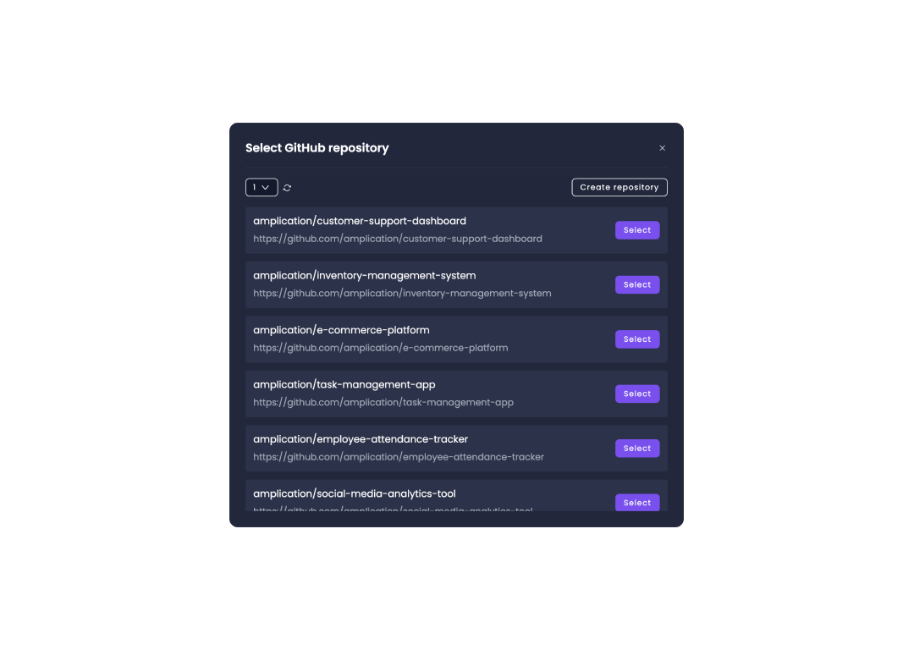

# How to Resolve GitHub Connection Errors in Amplication

If you encounter an "Internal server error" while attempting to select a repository or change the repository that your service is currently connected to in Amplication, follow these steps to resolve the issue.

## Step 1: Uninstall the Amplication GitHub App

1. Visit your [GitHub settings](https://github.com/settings/applications) and proceed to the "Installed GitHub Apps" tab.
2. Find the Amplication GitHub App and click on the `Configure` button.
3. Scroll to the bottom of the page and click on the `Uninstall` button.
4. Confirm the action by clicking "OK" in the pop-up window.

:::tip
Uninstalling the Amplication GitHub App **will not affect your code** or the current status of your projects and services in Amplication.
:::

## Step 2: Reinstall the Amplication GitHub App

1. Go back to your project in Amplication and refresh the page.
2. Click on `Add Organization` and reinstall the Amplication GitHub App into the GitHub account where you previously had it installed.
3. Choose whether to install the app for all repositories or only select repositories.
4. Click on the `Install` button.

## Step 3: Reconnect Your Service to the Repository

1. In the `Select Organization` dropdown, choose the account you just reinstalled the app in (it will be the last one on the list).
2. Click on the `Select Repository` button.
3. In the pop-up window, find and select the repository you want to connect your service to.

:::note
If you have many repositories, use the dropdown menu to navigate through the pages. The repositories are usually organized in reverse chronological order, with the most recently created ones at the end of the list.
:::

After completing these steps, you should be able to generate code and commit it to GitHub without encountering the internal server error.