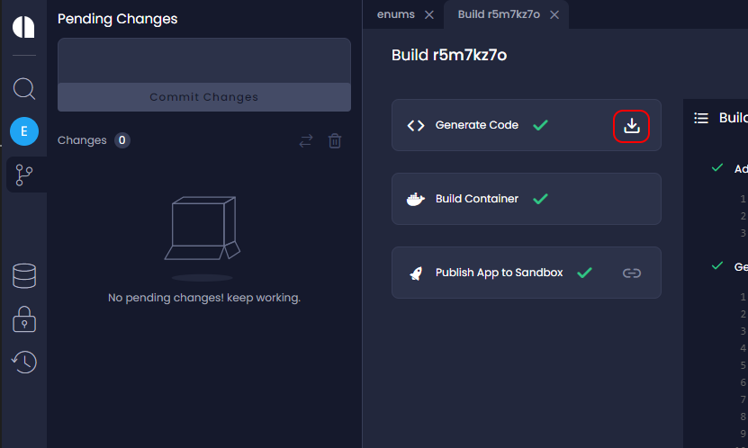
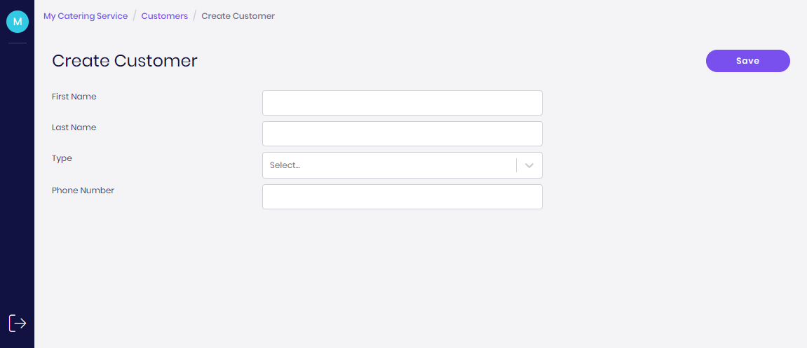

# Run Your Application in the Development Environment

To build and run your generated application in a local development environment follow this tutorial.
VS Code is used for demonstration in this article, but the process can be done on any IDE or directly in the command line with npm CLI.

## Summary

In this article you will go through the following steps:

1. Get the application source code
2. Install packages from npm for the server
3. Start docker container for your database
4. Initialize your database
5. Run your server
6. Install packages from npm for the Admin UI
7. Run the Admin UI

:::important
Before you start make sure you have Node.js 14, npm, and Docker installed.
:::

## Step 1 - Get the application source code

First, get your application source code from Amplication.

The best way to do it is to sync your application with a GitHub repository by following [this guide](/docs/sync-with-github).

Instead, if you prefer to download the source code as a ZIP file, follow these steps:

1. Commit all your changes so Amplication generates the updated source code.
2. Click on the **Download Code** button on the latest commit. You'll get a ZIP file.
3. Extract the ZIP file to a local folder.
4. Open your application with your favorite IDE



## Step 2 - Install packages from npm for the server

Your application is using npm for package management. To install all the necessary package follow these steps:

1. Open a command-line tool
2. Move to the **Server** folder

```
cd server
```

3. Execute npm install or npm i to download and install all the packages

```
npm install
```


## Step 3 - Start docker container for your database

Your application is shipped with a built-in connection to PostgreSQL DB. To start the database you need to run a docker container using the following command:

```
npm run docker:db
```

## Step 4 - Initialize your database

Now you need to create your application schema on the database. To do so Amplication uses Prisma and the Prisma migrate command.

First, execute the following command in the command-line tool to generate the Prisma client

```
npm run prisma:generate
```

Now, execute the following command in the command-line tool to generate the schema on the database

```
npm run db:init
```

:::tip
To view the full Prisma commands or any other script you can open the package.json file and look for the relevant command in the scripts section  
:::

## Step 5 - Run your server

That's it, your server is ready!
Execute the following command to start your server

```
npm run start
```

By default, your server is now available at http://localhost:3000

Try to open one of these URLs and have fun

- http://localhost:3000/api
- http://localhost:3000/graphql

To read more about the technologies and structure of your server read [this article](../../getting-started)

## Step 6 - Install packages from npm for the Admin UI

Now that your server is ready, you can build and run the Admin UI - a React client with ready-made forms for creating and editing all the data models of your application.

To install all the packages needed for the client, follow these steps:

1. in the command-line tool, move to the Admin folder. In case you are still in the Server folder, execute this command

```
cd ../admin-ui
```

2. Execute `npm install` or `npm i` to download and install all the packages

```
npm install
```

## Step 7 - Run the Admin UI

To run the React application with the Admin UI execute the following command

```
npm run start
```

By default, your client is now available at http://localhost:3001



:::tip
Make sure that the server is started and running in the background when initiating the admin UI. You can run npm run start for the admin UI in a separated shell from the one running the server.
:::
