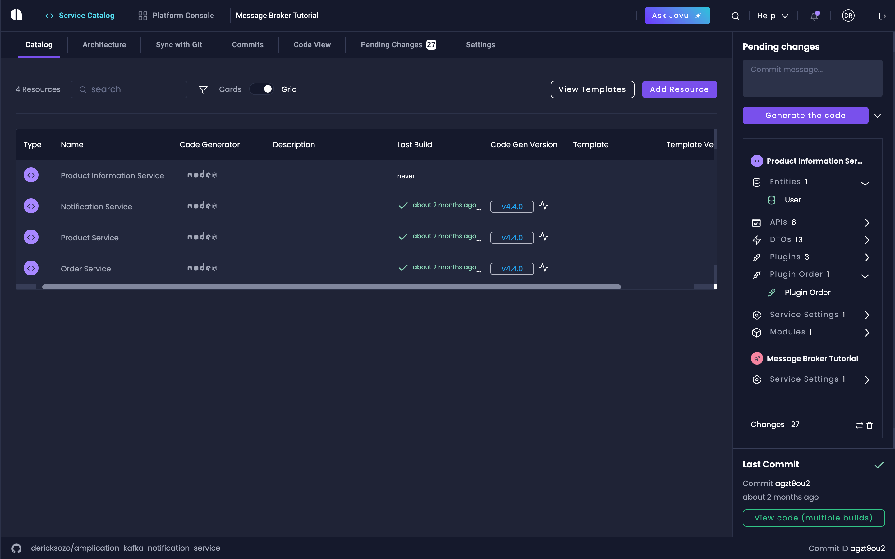
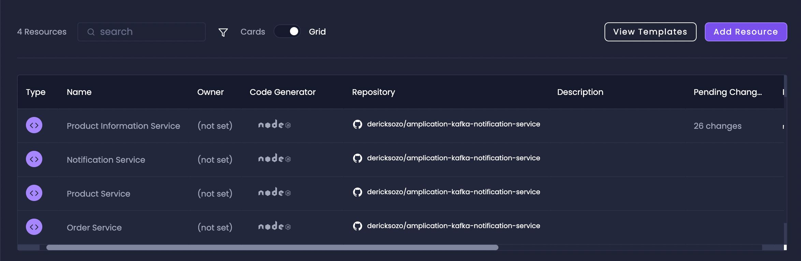
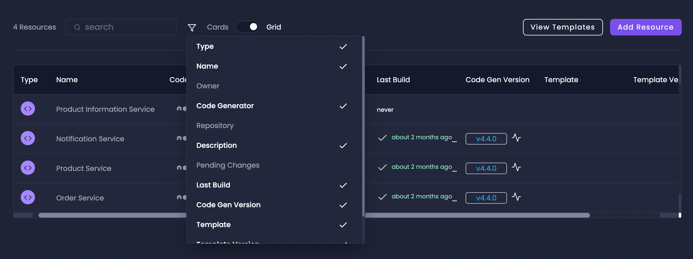
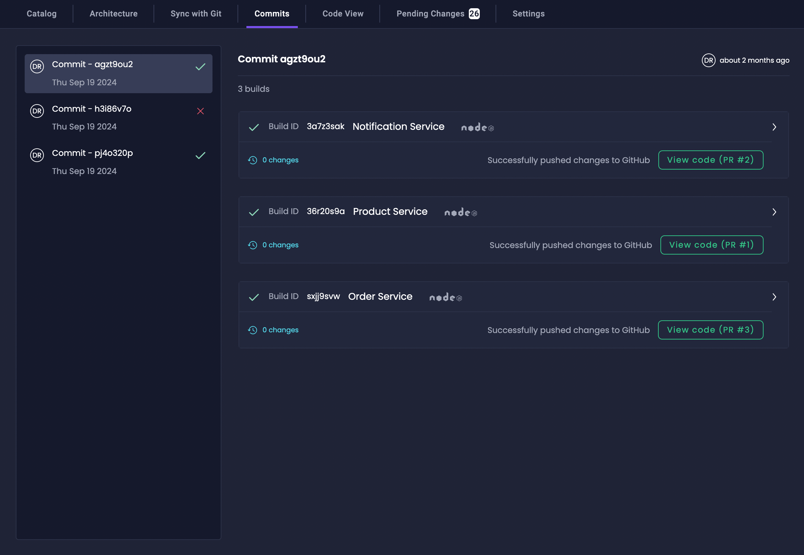
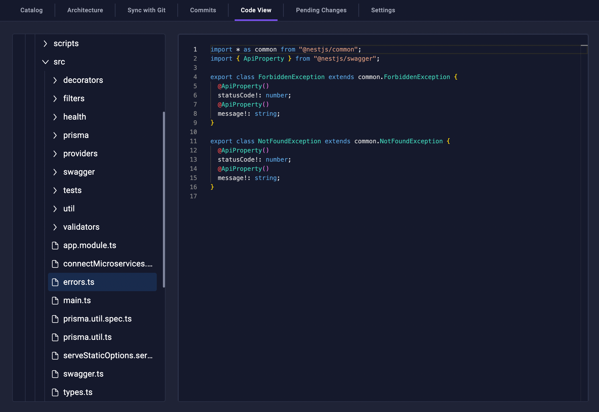
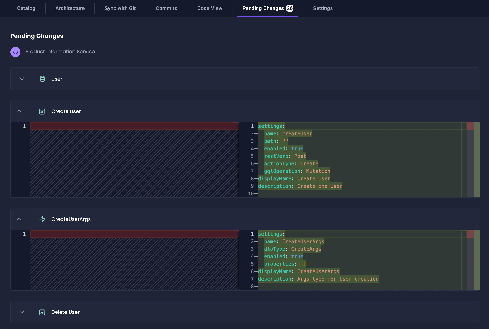
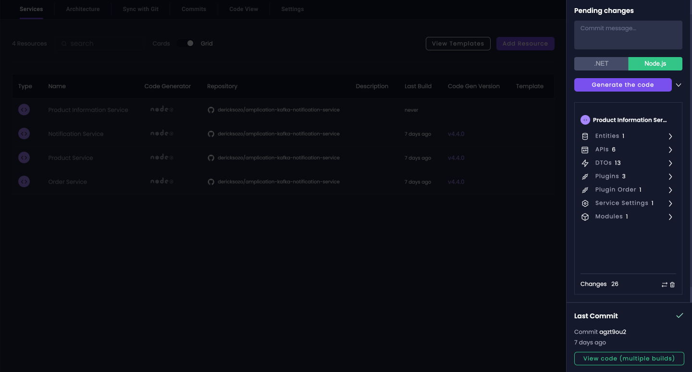

The **Service Catalog** is your central hub for managing and monitoring all services within your Amplication project.
It provides an intuitive interface to oversee your services, manage architecture, manage changes, and configure service settings.

## Overview

The Service Catalog offers a comprehensive suite of tools to manage your services:

- **Catalog**: View and manage your services, message brokers, and custom components in both grid and card layouts
- [**Architecture**](/break-the-monolith/): Visualize service relationships, entities, and dependencies
- [**Sync with Git**](/smart-git-sync/): Manage code synchronization with Git repositories
- **Commits**: Track build history and code changes across all services
- [**Code View**](/getting-started/view-generated-code): Access and review generated service code
- **Pending Changes**: Monitor and commit service modifications
- [**Settings**](/how-to/api-admin-ui-settings): Configure project-level settings for all services

## Catalog

The Catalog provides a flexible interface for viewing and managing your services, offering both grid and card layouts to suit different needs.
You can easily filter and search through your services, and access quick actions for common management tasks.

### Grid View

The Grid View provides a detailed, data-rich overview of your services, displaying:

- Service name and description
- Service type and technology stack
- Code generator version
- Connected Git repository
- Latest build status and timestamp
- Active plugins and templates

### Card View

The Card View presents services as visual cards, showing:

- Service name and description
- Technology stack icons
- Quick action buttons for common tasks
- Service status indicators

### Filter

The Filter feature lets you customize which columns are displayed in the Grid View by toggling specific column headers on or off. This granular control allows you to focus on the most relevant information for your current task, making it easier to manage and analyze your services according to your needs.

## Architecture

The Architecture tab lets you visualize and optimize your services' structure through an intuitive interface.
It enables you to map service relationships, plan service boundaries, and even break down monolithic applications into microservices using AI-assisted suggestions.
Through the visual editor, you can easily restructure your services while maintaining their relationships and dependencies.

Learn more about this feature in our [Break The Monolith guide](/break-the-monolith/).

## Sync with Git

Smart Git Sync automatically manages the synchronization between your Amplication projects and your Git repositories. It maintains an `amplication` branch that tracks all your changes, creates meaningful commit messages, and handles pull requests automatically. This streamlined process ensures your code stays synchronized while minimizing merge conflicts.

Explore the complete capabilities in our [Smart Git Sync documentation](/smart-git-sync/).

## Commits

The Commits tab provides a comprehensive build history for your services, enabling you to track every code generation and commit to your git repository.
You can access detailed build logs and review changes made in each build.
This historical view helps you maintain visibility over the evolution of your services.

## Code View

Code View allows you to explore and read your generated code after it gets synchronized with your repository.
You can browse through your service's codebase, examine generated files, and ensure everything is structured as expected.
The viewer provides a clear interface for code inspection without requiring a local checkout.

Find out more in our [Code View guide](/getting-started/view-generated-code/).

## Pending Changes

The Pending Changes tab gives you a complete overview of all modifications across your services before they're committed. It tracks everything from entity modifications to plugin updates, allowing you to review and verify changes before generating new code. This staging area ensures you have full control over what gets included in your next build.

## Settings

Settings provides centralized control over your project-level service settings.
Learn more about available options in our [Service Settings guide](/how-to/api-admin-ui-settings/).

## Pending Changes Sidebar

The Pending Changes sidebar displays modifications across your services, including:

- Plugin additions or updates
- Entity modifications
- Service configuration changes
- Template applications

When you click the "Generate the code" button, Amplication automatically builds all services with pending changes. To monitor the build process and results, you can access the [Build View](/building-new-versions/).

## Next Steps

Now that you understand the Service Catalog's capabilities, you can:

1. Create and organize your services using the Catalog view
2. Set up Git synchronization for your services
3. Monitor builds and deployments through the Commits tab
4. Review and manage code using the Code View
5. Configure service settings to match your requirements

For more detailed information about specific features, refer to our other documentation pages:

- [Architecture View Guide](/break-the-monolith/)
- [Smart Git Sync Documentation](/smart-git-sync)
- [Code View Tutorial](/getting-started/view-generated-code)
- [Service Settings Configuration](/how-to/api-admin-ui-settings)
