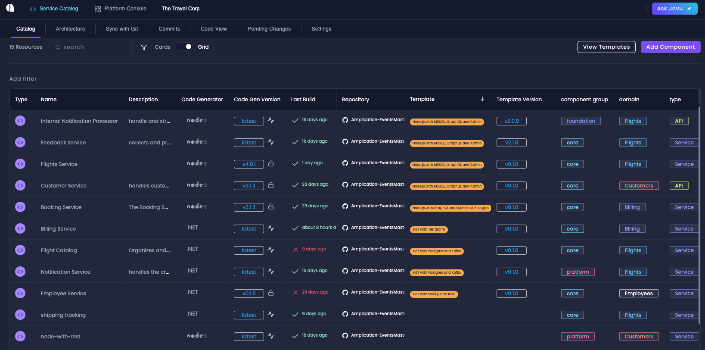

The **Service Catalog** is your central hub for managing and monitoring all services within your Amplication project. It provides an intuitive interface to oversee your services, track their configurations, and manage changes effectively.

The Service Catalog's main focus is the catalog view, which offers a comprehensive grid-based interface for managing your application services. This interface is designed to provide maximum visibility and control over your entire project.

## Grid Columns
The grid displays comprehensive information about each service through the following columns:

- **Type** - Displays the resource type with visual indicators: purple brackets icon for services, green icon for message brokers, and distinct icons for other resource types
- **Name** - The name of your service
- **Owner** - Shows the assigned team or individual member responsible for the service. Clicking this field takes you to settings where you can modify ownership
- **Code Generator** - Indicates the selected technology stack for the service
- **Repository** - Shows the connected Git repository. Can be modified through the service's "Sync with Git" tab
- **Description** - Custom description of your service, editable through the service settings
- **Pending Changes** - Displays the number of uncommitted changes since the last build
- **Last Build** - Shows build status (green checkmark for success) and timing (e.g., "2 days ago"). Clicking navigates to the specific commit details
- **Code Gen Version** - Displays the current code generator version with status indicators:
  - Lightning bolt: automatically updates to latest version
  - Lock icon: version is locked to specific release
- **Template** - Shows if the service was created from a template (orange icon). Clicking navigates to template details
- **Template Version** - Displays the current template version number, which increments with each newly published template
- **Actions** - Provides access to available operations for the service

## Customizing the Grid

### Column Management

- Drag columns left or right to reorder them
- Resize columns by dragging their edges
- Show/hide columns by clicking on the filter icon next to search

### Sorting

Click any column header to sort the grid:

- First click: Sort in ascending order
- Second click: Sort in descending order
- Third click: Remove sorting

### Filter View

You can filter the data that displays on your grid beyond the column management filters.
For example, you can filter by properties, resource types, project, ownership, and more.

To apply filters, click the "Add filter" button above the grid, select your desired filter type, and refine the filter criteria by clicking on the added filter component to narrow down your view.

### Teams Organization

Teams provide an additional layer of service organization and ownership management.

The owner (team or individual) is prominently displayed in the Service Catalog grid, allowing quick identification of who's responsible for each service.
You can click the owner field to modify ownership settings directly.

To set up and manage teams in your workspace, follow these steps:

1. Access Teams through the Teams tab in your workspace dashboard
2. Create new teams with:
   - Custom names
   - Descriptions
   - Distinctive colors (appears in the service catalog grid)
3. Add team members
4. Assign services to teams or individual members for ownership

### Properties

Properties allow custom organization of your services:

1. Access Properties through the Properties tab in your workspace dashboard.
2. Create new properties with:
   - Custom name and key
   - Optional description
   - Type selection:
     - **Select**: Single choice from predefined options
     - **Multi-select**: Multiple choices from predefined options
     - **Text**: Simple text field
     - **Link**: URL reference
3. For Select and Multi-select types:
   - Define custom options
   - Assign colors to options for visual organization in the grid

## Pending Changes Sidebar

The Pending Changes sidebar shows you modifications across your services, including:

- Plugin additions or updates
- Entity modifications
- Service configuration changes
- Template applications

When you're ready to apply changes, click the "Generate the code" button to build all services with pending modifications.

## Next Steps

Now that you're familiar with the Service Catalog, explore these additional capabilities:

- Create [live templates](/live-service-templates/) to standardize service configurations
- Develop [private plugins](/private-plugins/) to extend functionality
- Build and deploy [new versions](/building-new-versions/) of your services
- Integrate [custom code](/how-to/custom-code/) into your generated services
