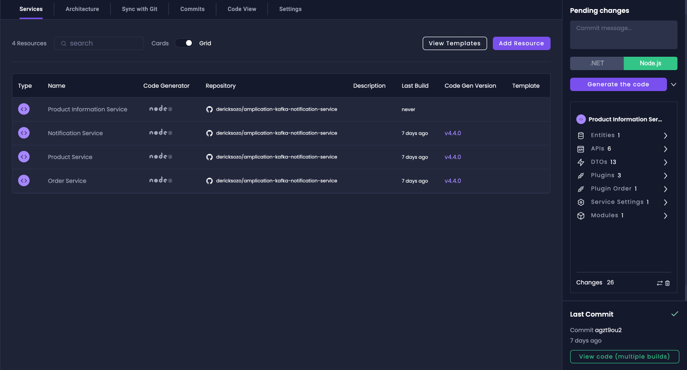
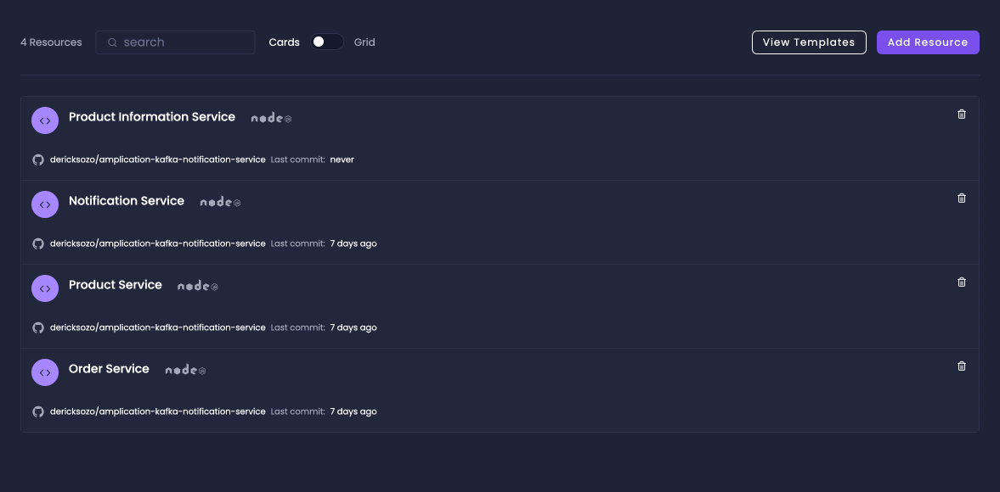
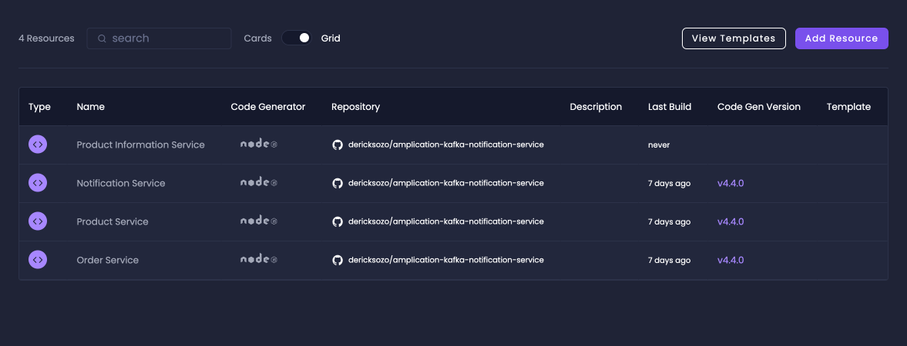

The **Services Dashboard** is a central feature in Amplication that allows you to manage and oversee all the services within your projects. This dashboard provides a comprehensive view of your services, their statuses, and quick access to various management tools.

## Overview

The Services Dashboard offers two main views for managing your services:

1. **Cards View**: The default view, presenting services as individual cards with basic information.
2. **Grid View**: A compact, data-rich view providing detailed information about each service.

You can access the Services Dashboard by clicking on the "Services" button next to the "Platform" button on the individual card associated with your project on the workspace overview page.

From this dashboard, you can access all the essential parts of your service management, including sync with Git, settings, architecture view, and more.

## Managing Services

From the Services Dashboard, you can access various tools and features for each service:

- [Architecture View](/break-the-monolith/): Visualize and manage your service architecture.
- [Sync with Git](/smart-git-sync): Manage Git synchronization for your services.
- [Code View](/getting-started/view-generated-code): Access and review the generated code for your services.
- Commits: View and manage previous builds and commits for your services.
- [Settings](/how-to/api-admin-ui-settings): Configure various settings for your services.

## Cards View

The Cards View is the default view of the Services Dashboard. Each service is represented by a card that displays:

- Service name
- Technology framework
- Basic overview information

This view is ideal for a quick, visual overview of your services.

## Grid View

The Grid View offers a more compact and information-rich display of your services. To switch to Grid View, click the toggle next to the search bar to change from Card View to Grid View.

In Grid View, you can see:

- Service name
- Service type
- Code generator version
- Connected repository
- Service description (if available)
- Last build information

The Grid View is particularly useful when you need to compare multiple services or access detailed information quickly.

## Pending Changes Sidebar

The Pending Changes sidebar, located on the right side of the dashboard, shows service-level changes. This can include things like:

- New plugins added
- Entity changes
- Service setting modifications

After reviewing the pending changes, you can click the "Generate Code" button to commit these changes to the associated repository. To view the build process and results, you can access the [Build View](/building-new-versions/).

## Next Steps

Now that you understand how the Services Dashboard is organized and everything it is capable of, you can start diving into your services to make all the necessary changes and additions. Explore each service, utilize the different views, and take advantage of the various management tools available to streamline your development process.