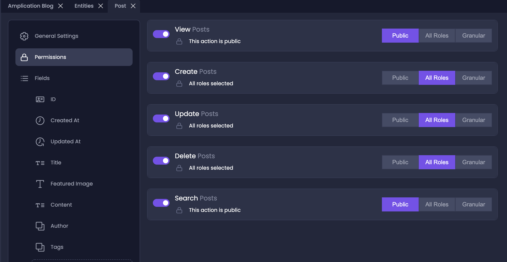
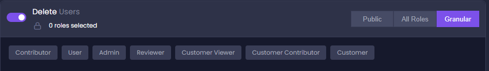
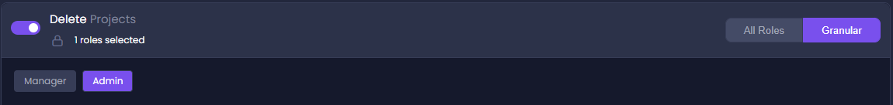
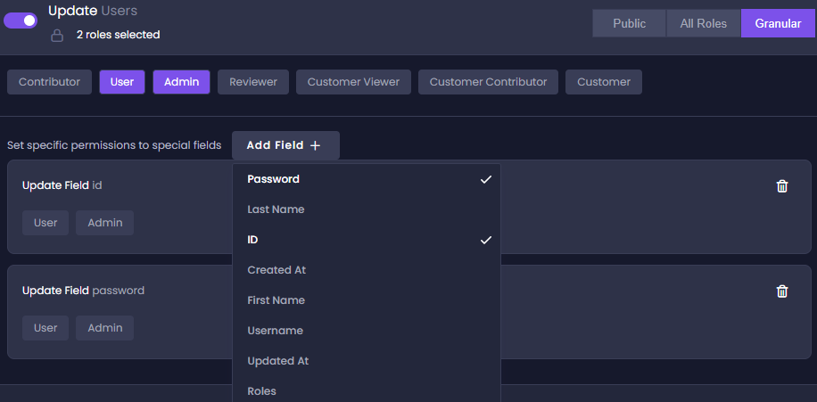
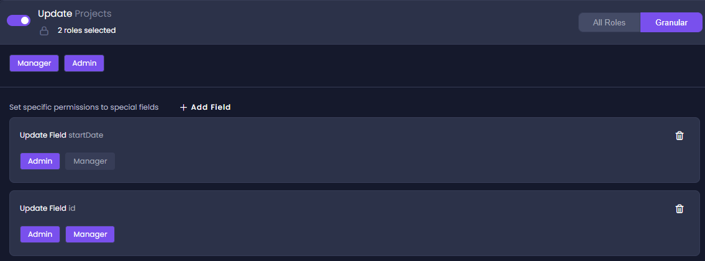

# Set Access Permissions 

To control users to access an entity, we must set its permissions. We can also set permissions at the field level. 

Permissions can be controlled separately for each of the following actions:

- **View**
- **Create**
- **Update**
- **Delete**
- **Search**

These actions can be set to one of the following:
- **Public** - no authentication is required, so the action is available to all users, not only those with defined roles 
- **All Roles** - all roles can perform the action (default)
- **Granular** - only specified roles can perform the action

## Set Entity Permissions

1. Click the **Entities** icon in the main menu (left sidebar) to open the _Entities_ page.
2. Click an entity.
3. On the entity's page, click **Permissions**.

   By default, all actions (_View_, _Create_, _Update_, _Delete_, and _Search_) are set to **All Roles**. 

4. Select **All Roles** (default), **Public**, or **Granular**.

4. If you selected **Granular** to enable the configuration of the actions according to specific roles, continue with the next steps. 

:::tip
After selecting **Granular**, and before selecting specific roles, this action cannot be performed by any role.
:::

5. To give a specific role permission to perform the action, select the appropriate button. 

   For example, we can give permissions to perform the **Delete** action to the **Admin** role. 
   
:::tip
When selecting a specific field, it will  be available only for the selected roles for that field, and by default will not be available for any role that was not selected.
:::

## Set Field Permissions 

You can set permissions at the field level.

 1. Click **Add Field +** and select the required fields from the drop-down list.

2. Select the roles you want to associate with each selected field. 

