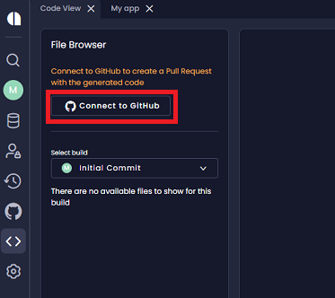
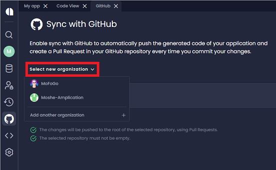
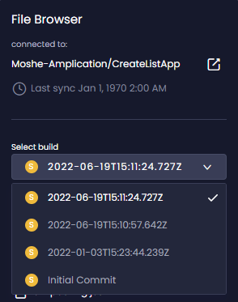
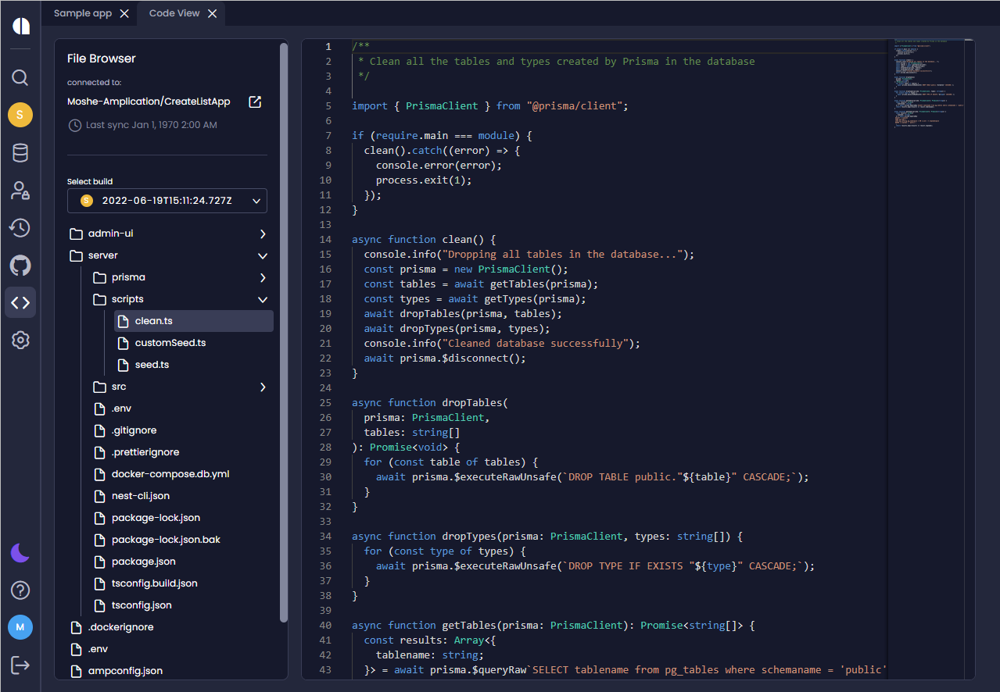

# View Generated Code

Use  **Code View** to view and explore the generated code. You can see the updated code before it is synced with GitHub or downloaded. 

1. On the _Overview_ page, click **View Code**, or click the **Code View** icon on the menu.

    If you are not connected to GitHub, the the **Connect to GitHub** button is displayed. 

2. To connect to GitHub, perform the following steps:

    a. Click  **Connect to GitHub** 

    

    b. Select or add an organization from the **Select new organization** list. 

    

    c. Click **Select repository** or **Create repository** and follow the onscreen instructions.

2. Once connected to GitHub, you can select a build from the **Select build** list. 

    

    :::note
    - The default build is the last one you created.
    - You can create a new build even if you have not made any changes.
    - _Code View_ does not support builds created in earlier Amplication versions, before the feature had been introduced. 
    - If you perform a commit within a build, it will update the build but will not create a new build. 
    :::

3. Navigate to the required file. The code is displayed. 

   

:::note
- Graphic files are not visible with _Code View_.
- You cannot edit files with _Code View_.
:::