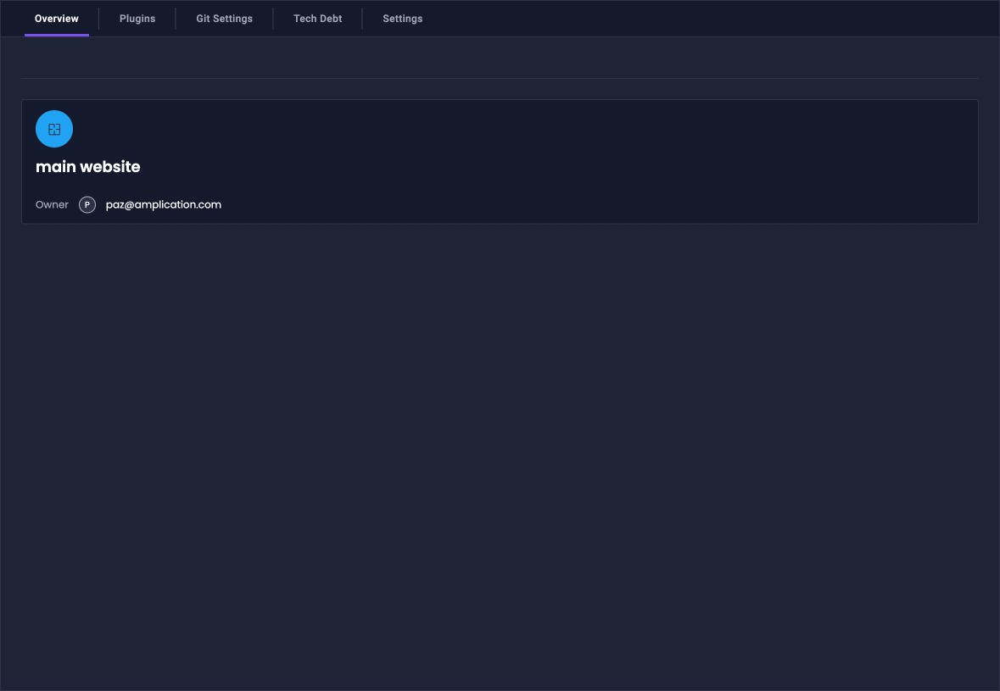
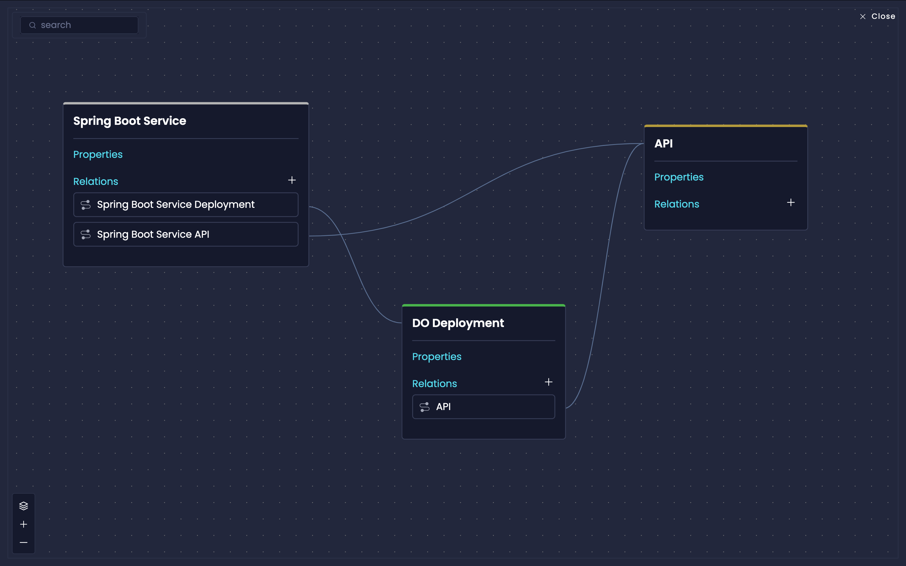

# Blueprints

Blueprints are a powerful feature that lets organizations create and manage any type of resource in their development ecosystem.
Whether you're building Java microservices, Python SDKs, React front-end apps, Terraform configurations, or PostgreSQL database setups, Blueprints provide a flexible way to define, generate, and manage these resources.

## Why Use Blueprints

Blueprints enable organizations to implement their own standards, best practices, and technology choices across their development ecosystem.
You can create standardized resources that match your specific requirements while maintaining consistency across teams and projects.

With Blueprints you can:

- Describe any piece of software like SDKs, deployment configs, front-end apps, and even Amplication plugins.
- Create resources using your preferred technologies and frameworks
- Implement organization-specific development standards
- Define relationships between different parts of your system
- Generate sophisticated and dynamic code based on resource relationships
- Create reusable components that follow your architectural patterns

## How To Access Blueprints

Access Blueprints from your Workspace by navigating to the dedicated Blueprints tab, where you can create and manage all your blueprints.

1. Navigate to your workspace settings
2. Select the "Blueprints" tab
3. Begin creating and managing your blueprints

## Core Concepts

### Blueprint

A blueprint defines how a specific type of resource will be implemented in your project. It provides the foundation for generating consistent, standardized resources that align with your organization's architecture and practices. Each blueprint serves as a template that can generate multiple resources based on your requirements.

### Resource

A resource is a specific instance of a blueprint that developers use in their projects.
When you create a resource from a blueprint, you get a fully configured instance that follows your organization's standards and best practices.

You manage blueprint resources using the same tools available for other resources in your project, like services.

### Plugins

Plugins define the code generation logic for your blueprints. When you create a resource from a blueprint, its associated plugins determine how the actual code and configuration files are generated.

Each plugin can provide specific functionality for your blueprint.
For example:

- Custom code generation logic for your technology stack
- Infrastructure and deployment configurations
- Integration patterns and configurations
- Organization-specific development standards

:::note
Organizations can create private plugins to implement their specific requirements and standards. Visit the [Private Plugins](/private-plugins) page to learn more.
:::

### Relations

Relations define connections between different blueprints, enabling you to model sophisticated relationships in your architecture.
These relationships are available during the code generation process, allowing plugins to generate dynamic code based on connected resources and their configurations.

For example, you can:

1. Connect services to their deployment configurations
2. Link services to their respective databases
3. Define dependencies between different components

The context from these relationships enables intelligent code generation that understands how your resources interact and depend on each other.

## Next Steps

- **Create Your First Blueprint** - Learn how to create, configure, and implement your first blueprint resource
- **Working with Blueprint Relations** - Discover how to connect blueprints to model your system architecture
- **Blueprint Examples and Use Cases** - Explore real-world examples of how to use blueprints effectively