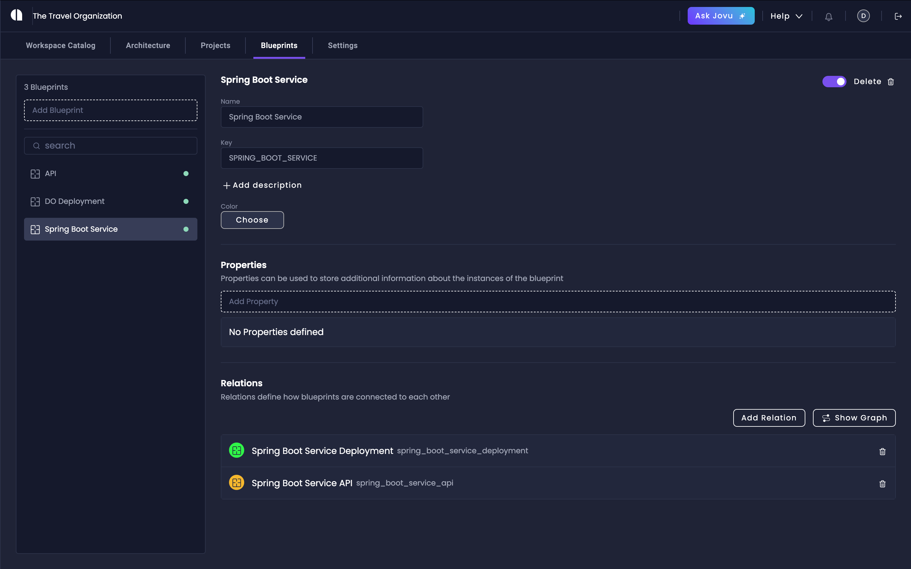

# Blueprints

Blueprints are a powerful feature that let organizations create and manage any type of resource in their development ecosystem.
Whether you're working with Java services, Python apps, deployment configurations, or database setups, Blueprints provide a flexible way to define, generate, and manage these resources.

## Why Use Blueprints

Amplication provides enterprise-grade code generation for Node.js and .NET services, offering integration with industry-leading tools like Prisma, PostgreSQL, and MongoDB.

With Blueprints, we expand these capabilities to support any programming language, framework, database, or deployment option your team uses.
This allows you to create standardized resources that match your organization's specific technology choices and requirements.

With Blueprints you can:

- Create resources for any programming language or framework
- Standardize resource creation across your organization
- Define custom deployment configurations
- Connect external services and APIs
- Set up database resources

## How To Access Blueprints

Access Blueprints from your Workspace by navigating to the dedicated Blueprints tab, where you can create and manage all your blueprints.

1. Navigate to your workspace settings
2. Select the "Blueprints" tab
3. Begin creating and managing your blueprints

## Core Concepts

### Blueprint

A blueprint defines how a specific type of resource will be implemented in your project. It provides the foundation for generating consistent, standardized resources across your organization. Each blueprint can generate multiple resources based on your specific requirements.

### Resource

A resource is a specific instance of a blueprint that developers use in their projects.
When you create a resource from a blueprint, you get a fully configured instance that follows your organization's standards and best practices.
You can manage that blueprint resource with the same tools that you can other resources 
For example, you can create multiple Java microservices from a single Java Spring Boot blueprint.

### Plugins

Plugins define the code generation logic for your blueprints. When you create a resource from a blueprint, its associated plugins determine how the actual code and configuration files are generated.

Each plugin can provide specific functionality for your blueprint. For example:

- Code generation for specific programming languages
- Infrastructure configurations like Terraform files
- Database schema definitions
- API integrations and configurations

:::note
Organizations can create private plugins to implement their specific requirements and standards. Visit the [Private Plugins](/private-plugins) page to learn more.
:::

### Relations

Relations define connections between different blueprints, allowing you to model in-depth relationships in your architecture. For example, you can:

1. Connect service blueprints to their deployment configurations
2. Link services to their respective databases
3. Define dependencies between different components

## Next Steps

- **Create Your First Blueprint** - Learn how to create, configure, and implement your first blueprint resource
- **Working with Blueprint Relations** - Discover how to connect blueprints to model your system architecture
- **Blueprint Examples and Use Cases** - Explore real-world examples of how to use blueprints effectively