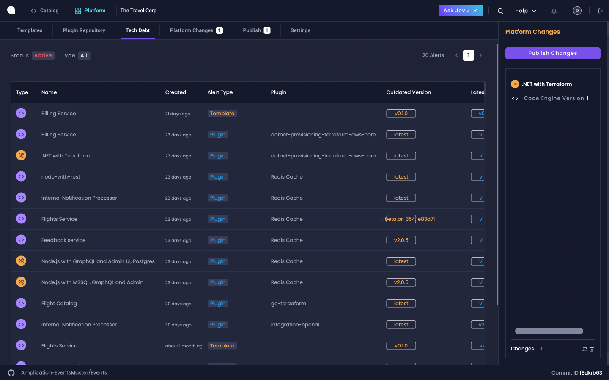
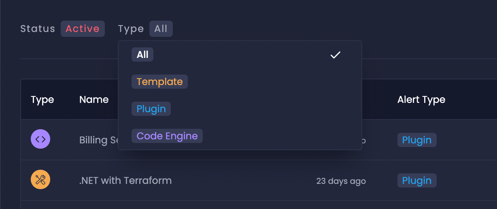
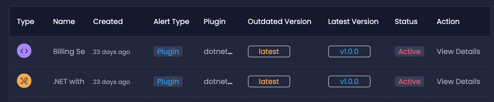
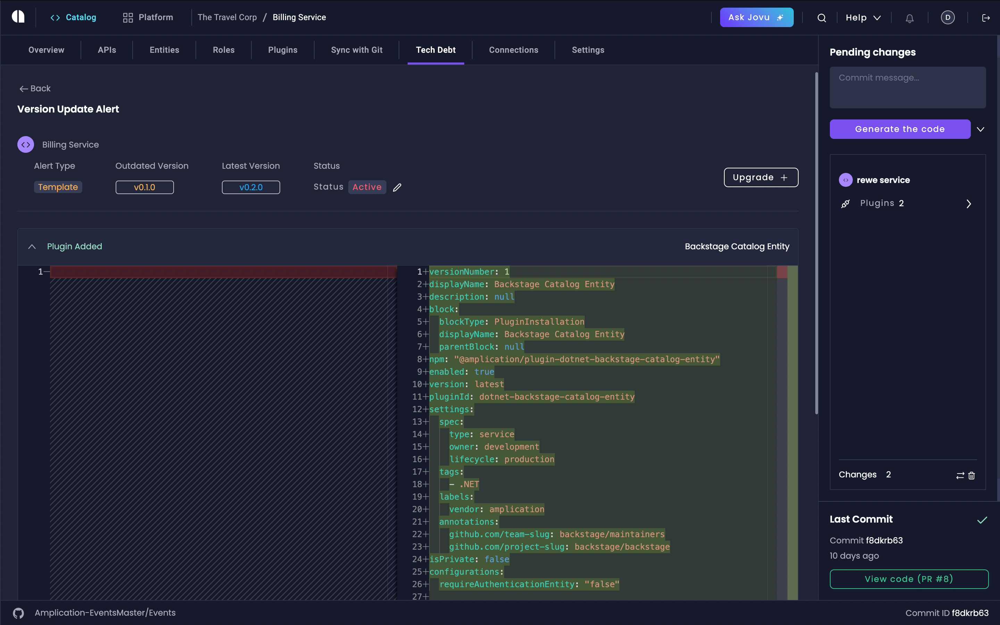
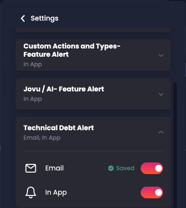

# Technical Debt Management

Amplication's Technical Debt Management system helps you maintain alignment between your services and organizational standards as they evolve. This feature provides automated alerts, easy updates, and comprehensive tracking to ensure your services stay current with the latest templates, plugins, and best practices.

## Key Features

- **Automated Technical Debt Detection**: Receive alerts when services, templates, or plugins become outdated
- **Centralized Management**: Track and resolve technical debt across all services from a single dashboard
- **Git Sync Integration**: Automated pull request generation for updates using [Smart Git Sync](/smart-git-sync/).
- **Flexible Resolution Options**: Choose when and how to address technical debt
- **Notification System**: Stay informed through in-app and email notifications

## Accessing Technical Debt Management

1. Navigate to the Platform Console by clicking "Platform" in the top left corner
2. Select the "Tech Debt" tab

## Understanding Technical Debt Alerts

### Alert Types

Amplication tracks three primary categories of technical debt:

1. **Template Alerts**: Notify when a service needs updating to match new template versions
2. **Plugin Alerts**: Indicate when plugin updates are available or when plugins require attention
3. **Amplication Code Engine Alerts**: Signal updates to Amplication's code generation engine

### Alert Properties

Each alert contains essential information:
- **Alert Type**: Specifies whether the alert is related to templates, plugins, or the code engine
- **Affected Resource**: Identifies the specific service or template that requires attention
- **Current Version in Use**: The version of the template, plugin, or code engine currently being used
- **Latest Available Version**: The most recent version available for update
- **Alert Creation Date**: The date when the system identified the technical debt
- **Alert Status**: Current state of the alert (Active, Resolved, Ignored, or Canceled)

## Managing Technical Debt

### Viewing Alerts

The Technical Debt dashboard provides a comprehensive view of all alerts:

1. **Status Filter**: Filter alerts by:
   - Active (default view)
   - Resolved
   - Ignored
   - Canceled

2. **Type Filter**: Filter by:
   - Template alerts
   - Plugin alerts
   - Code Engine alerts

## Resolving Technical Debt

### Template Updates

1. Click "View Details" on a template alert
2. Review the changes between versions in the diff view
3. Click "Upgrade" to accept the changes
4. Confirm the upgrade in the modal dialog

:::note
After upgrading, changes become pending changes. Generate code to create individual PRs for the updates using the code generation workflow.
:::

### Plugin Updates

For services using "latest" version:
1. Click "View Details" on the plugin alert
2. The plugin will automatically update on the next code generation

For services using pinned versions:
1. Click "View Details"
2. Generate code to apply changes

## Notification Settings

Customize how you receive technical debt alerts:

1. Click the bell icon in the upper right corner
2. Scroll to "Technical Debt Alert" settings
3. Configure preferences for:
   - In-app notifications
   - Email notifications

## Integration with Development Workflow

Technical debt management integrates seamlessly with your development process:

1. **Alert Detection**: Amplication automatically detects when services drift from standards
2. **Review Process**: Team members can review and approve updates
3. **Code Generation**: Updates are applied through your normal code generation workflow
4. **Git Workflow**: Changes are managed through your existing Git workflow

## Related Resources

If you need additional support, please contact Amplication support team for assistance.

- [Live Templates](/live-service-templates/)
- [Private Plugins](/private-plugins/)