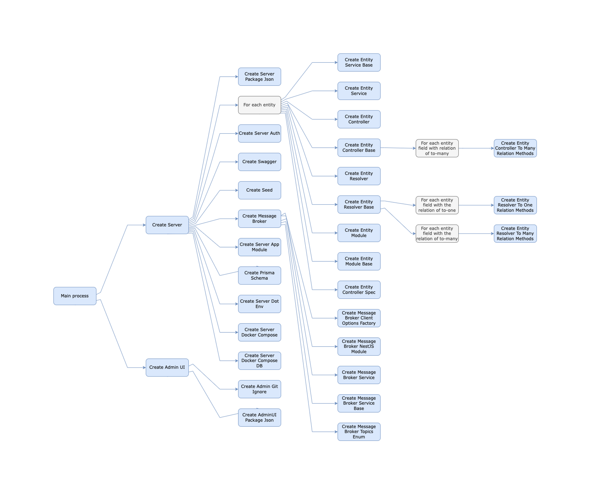

# Event Hierarchy

We have two main event hierarchies in our Data Service Generator (DSG) service: one for Node.js services and one for .NET services. Each of these hierarchies includes events to create the server's files and, in the case of Node.js, the admin-ui files.

## Node.js Event Hierarchy

For Node.js services, we have two main events: one for the server creation and the other for the admin-ui creation. **These events are running simultaneously, and there is no guarantee which will finish first.**

Each of these main events includes other events to create the server's files and the admin-ui files (in our source code, it is sometimes referred to as `modules`).

The following diagram represents the execution order of the events in DSG for Node.js:

## .NET Event Hierarchy

For .NET services, the event hierarchy is focused on server-side generation. It includes events for creating various components of the .NET service, such as controllers, services, models, and infrastructure elements.

Key events in the .NET hierarchy include:

1. [`CreateServer`](/plugins/dotnet-plugin-events-reference/#createserver): The main event for creating the .NET server.
2. [`CreateProgramFile`](/plugins/dotnet-plugin-events-reference/#createprogramfile): Creates the main program file for the .NET application.
3. [`CreateEntityController`](/plugins/dotnet-plugin-events-reference/#createentitycontroller) and [`CreateEntityService`](/plugins/dotnet-plugin-events-reference/#createentityservice): Create controllers and services for each entity.
4. [`CreateServerAuth`](/plugins/dotnet-plugin-events-reference/#createserverauth): Sets up authentication for the .NET server.
5. [`CreateServerDockerCompose`](/plugins/dotnet-plugin-events-reference/#createserverdockercompose): Generates Docker Compose files for the .NET server.

The exact order of execution may vary, and some events may run in parallel. For a complete list of .NET events, descriptions, parameters, and examples, refer to the [.NET Plugin Events Reference](/plugins/dotnet-plugin-events-reference) page.

:::note
The event hierarchies for Node.js and .NET are distinct and tailored to the specific needs and structures of each platform.
:::