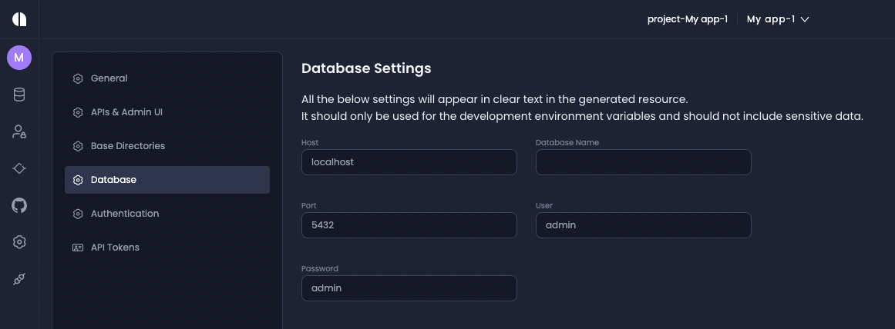

# Create Server Dot Env

## Description

Creates the server's `.env` file

## Event Name
`CreateServerDotEnv`

## Event Params

```ts
export interface CreateServerDotEnvParams extends EventParams {
  envVariables: VariableDictionary;
}
```

```ts
export type VariableDictionary = {
  [variable: string]: string;
}[];
```

### envVariables
An Array of objects represents the key-value pairs the user wants to add to the generated `.env` file.

**Example**

```ts
export const envVariables: VariableDictionary = [
  { DB_USER: "${dbUser}" },
  { DB_PASSWORD: "${dbPassword}" },
  { DB_PORT: "${dbPort}" },
  {
    DB_URL: "mysql://${dbUser}:${dbPassword}@${dbHost}:${dbPort}${dbName}",
  },
];

beforeCreateServerDotEnv(
    context: DsgContext,
    eventParams: CreateServerDotEnvParams
  ) {
    eventParams.envVariables = [...eventParams.envVariables, ...envVariables];

    return eventParams;
  }
```

The values: `${dbUser}` , `${dbPassword}` , `${dbPort}`, `${dbHost}` , `${dbName}` are coming from:
my-project => my-service => settings => database




As you can see in the screenshot, the only variable that doesn't have a default value is the  `${dbName}`.
When you install one of the DB plugins, the value of  `${dbName}` is the service name.

