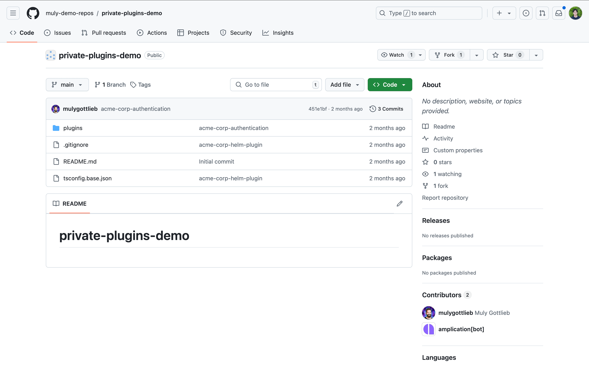
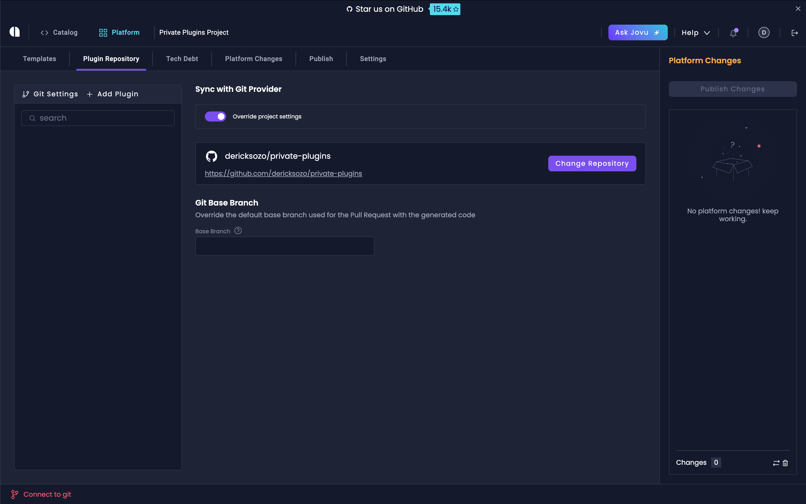
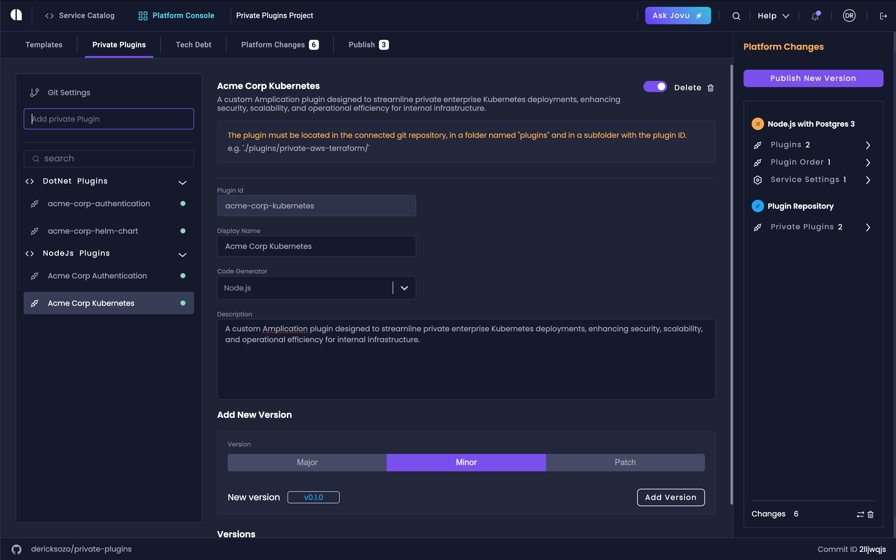
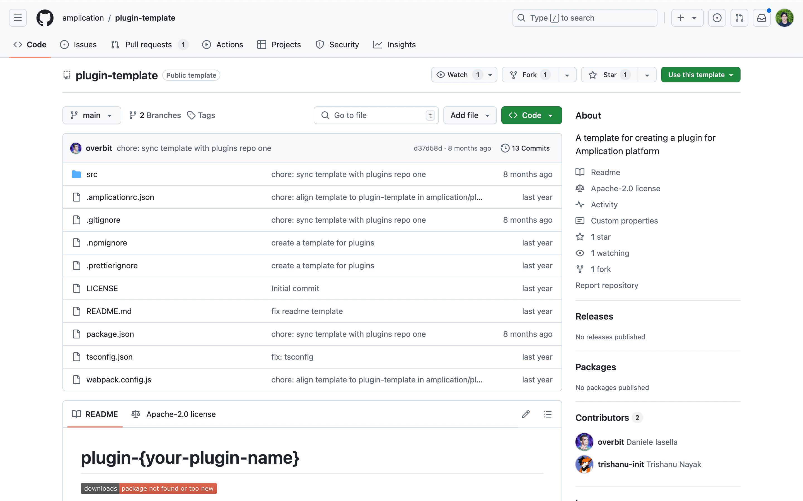
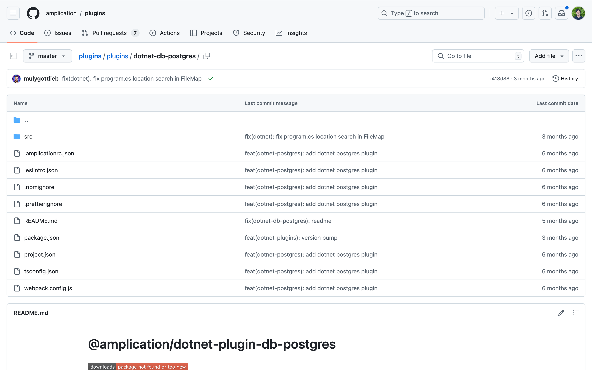
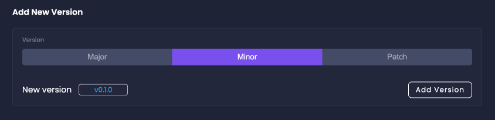
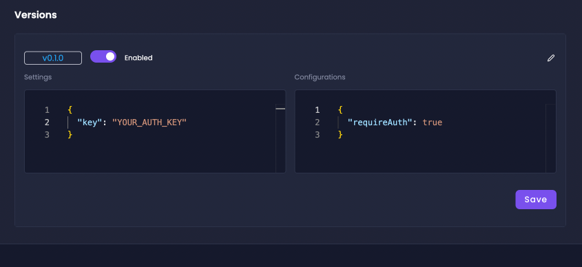
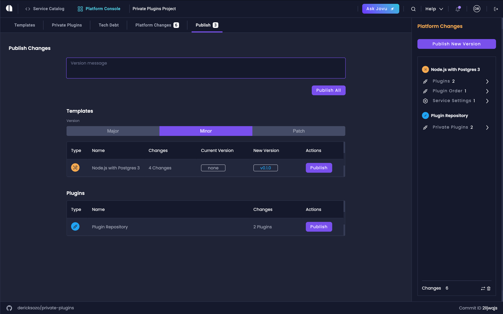
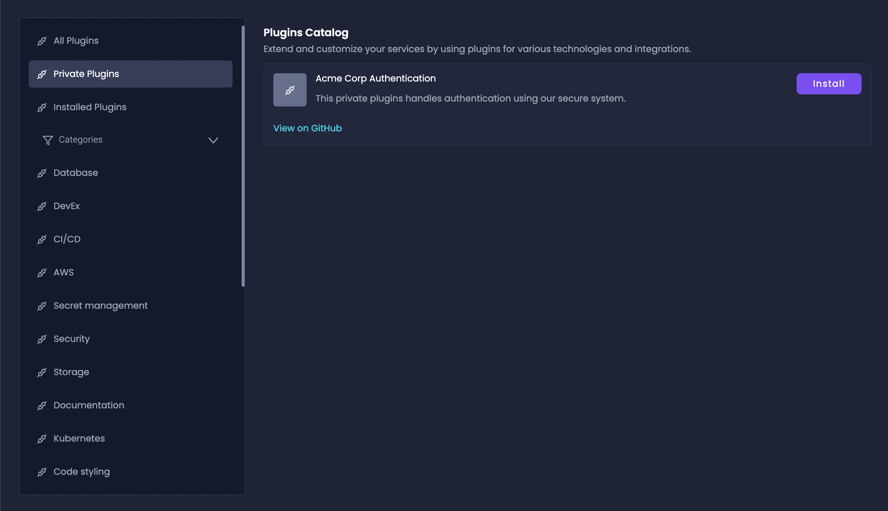

# Creating and Using Private Plugins

Private Plugins enable you to create [custom plugins](/plugins/overview/) exclusively for your organization's use. These plugins let you build secure, proprietary integrations while protecting sensitive business logic.

:::note
Private Plugins are only **available for Enterprise Plan users**.
:::

Unlike community plugins hosted on public package managers, private plugins reside in your own Git repository, giving you complete control over your plugin infrastructure and code.

## Create Your Private Plugins Repository

First, set up a dedicated Git repository to host your plugin's source code and builds:

1. Create a new Git repository specifically for your private plugins
2. Create a `plugins` folder in the repository root

The `plugins` folder will contain separate folders for each of your private plugins.



## Configure Git Settings In Platform Console

Next, configure your private plugins repository in the Platform Console:

1. Navigate to your project's **Platform Console** from the top header
2. Click the **Private Plugins** tab
3. Select **Git Settings** in the left sidebar
4. Enable the **Override default settings** toggle
5. Choose your dedicated plugin repository from the dropdown

:::important
Never use the same repository for private plugins and generated services to avoid build conflicts.
:::



## Add a New Private Plugin

Next, add a new private plugin to your Platform Console:

1. In the Private Plugins tab's sidebar, click the `Add Private Plugin` field
2. Enter a unique name using kebab-case (e.g., `acme-corp-authentication`)
3. Set the plugin's **Display Name** and **Description** - these will appear in the UI when selecting plugins
4. Choose the appropriate code generator (Node.js or .NET) that matches your target services

The Plugin Id you enter will become the name of your plugin's folder within the `plugins` folder.



## Set Up Your Private Plugin Folder

After creating the plugin entry in the Platform Console, set up your development environment.

### For Node.js Plugins:

You can get started using our Node.js plugin template.



First, navigate to the plugins folder.

```bash
cd plugins
```

Next, clone the plugin template and name it with your plugin's `Plugin Id`.

```bash
git clone https://github.com/amplication/plugin-template your-plugin-id
```

### For .NET Plugins:

To create a new .NET plugin, we recommend copying and modifying the existing .NET Postgres Database plugin as a starting template.



First, navigate to the `plugins` folder within your project:

```bash
cd plugins
```

Next, clone the .NET Postgres Database plugin.

To avoid downloading the entire repository, we’ll use a sparse checkout to copy only the `dotnet-db-postgres` folder from Amplication’s plugins repository.

Follow the steps below to complete this process:

1. **Initialize the Clone Without Checking Out Files**  
   Begin by cloning the Amplication plugins repository without checking out any files:

   ```bash
   git clone --no-checkout https://github.com/amplication/plugins
   ```

2. **Set Up Sparse Checkout for the Plugin**  
   Specify that you only want to download the `dotnet-db-postgres` folder:

   ```bash
   git sparse-checkout set plugins/dotnet-db-postgres
   ```

3. **Check Out the Specified Folder**  
   Now, check out the files. This will only download the `plugins/dotnet-db-postgres` folder:

   ```bash
   git checkout
   ```

4. **Rename the Folder to Your Plugin ID**  
   Finally, rename the cloned `dotnet-db-postgres` folder to match your plugin’s `Plugin Id`:

   ```bash
   mv plugins/dotnet-db-postgres your-plugin-id
   ```

## Develop Your Plugin

Now that your plugin structure is set up, it's time to start building your plugin.
We've prepared several resources and reference materials to help guide your plugin development process.

Core Documentation:

- [Private Plugins Overview](https://docs.amplication.com/plugins/overview/)
- [.NET Plugin Events Reference Guide](https://docs.amplication.com/plugins/dotnet-plugin-events/create-server/)
- [Node.js Plugin Events Reference Guide](https://docs.amplication.com/plugins/plugin-events/create-server/)

Community Plugin Examples:

- Browse the [official plugins repository](https://github.com/amplication/plugins/tree/master/plugins) for real-world examples

:::note
Study the published Node.js and .NET community plugins for best practices and guidance on how to structure your code effectively.
:::

## Add Versions to Your Plugin

After developing your plugin, you'll need to version it both in Amplication and your Git repository.
First, let's add a version through the Amplication UI:

1. Navigate to the Private Plugins tab and select your plugin
2. Scroll to **Add New Version** and click `Add Version`
3. Note the version number you assign (e.g., `0.1.0`)



## Tag Your Git Repository

Next, let's add a git tag to your plugin.
Amplication uses Git tags to identify plugin versions during code generation.

Create a tag with your Plugin ID and version from the previous step:

```bash
git tag "your-plugin-id@0.1.0"
```

Push the tag to your remote repository:

```bash
git push origin "your-plugin-id@0.1.0"
```

## Configure Plugin Settings

Plugin settings allow you to define customizable options that users can configure when using your plugin. These settings can include API keys, feature flags, or other configuration values that modify your plugin's behavior.

1. Click the **Edit** button (pencil icon) next to your version
2. Configure user-facing settings in the **Settings** field:
   ```json
   {
      "apiKey": "default-api-key",
      "enableFeatureX": true
   }
   ```
3. Set internal configurations in the **Configurations** field:
   ```json
   {
      "requireAuthenticationEntity": true
   }
   ```



:::note
For a real-world example of using settings in your plugin, check out the [Supertokens authentication plugin](https://github.com/amplication/plugins/blob/a94dac7956e51903df0240eef7b704999fc6a752/plugins/auth-supertokens/src/index.ts#L160).
For more detailed information about settings and configurations, see our [plugin settings documentation](/plugins/define-plugin-settings).
:::

## Publish Your Plugin

After adding a version to your plugin, configuring your plugin settings, and tagging your repository, it's time to publish your plugin.

1. Go to your Platform Console
2. Click on "Publish New Version" in your Platform Changes sidebar
3. Add an optional version message
4. Click **Publish** to make your changes available



## Use Private Plugins in Templates and Services

You can use your private plugins in both templates and services, provided the code generator matches your plugin's code generator.

### Include the Plugin in a Template

1. Navigate to the Templates tab in your Platform Console
2. Click on Create Template
3. Ensure that your template's code generator matches your private plugin's code generator
4. In your template's overview page, click on Plugins
5. Go to the Private Plugins tab on the left sidebar
6. Click Install on your private plugin

### Include Plugin in a Service

1. Navigate to your service in the Platform Console
2. Click on the Plugins tab
3. Look for your private plugin in the Private Plugins section
   :::note
   Your plugin will only appear if its code generator matches your service's code generator
   :::
4. Click Install to add the plugin to your service



### Configure Plugin Settings

1. Go to the Installed Plugins tab in the left sidebar
2. Click Settings next to your private plugin
3. Enter the JSON configuration that matches your plugin's user-facing settings

## Best Practices and Common Pitfalls

### Repository Management

- Keep private plugins in a dedicated git repository separate from services
- Maintain proper version control with meaningful commits

### Code Generator Compatibility

- Always match plugin and service code generators
- Verify compatibility before starting development

### Version Control

- Use correct tag format: `PluginId@Version`
- Always push tags to remote repository that match the tag you set in the UI

### Common Issues and Solutions

- Undefined property errors: Verify plugin versions and publishing
- Dependency errors: Check `package.json` configuration
- Build failures: Review logs and ensure proper repository setup

## Next Steps

You successfully created your private plugin.
It's version-controlled in your Git repository and available for use in both templates and services that match its code generator.

For additional support, contact our support team.
