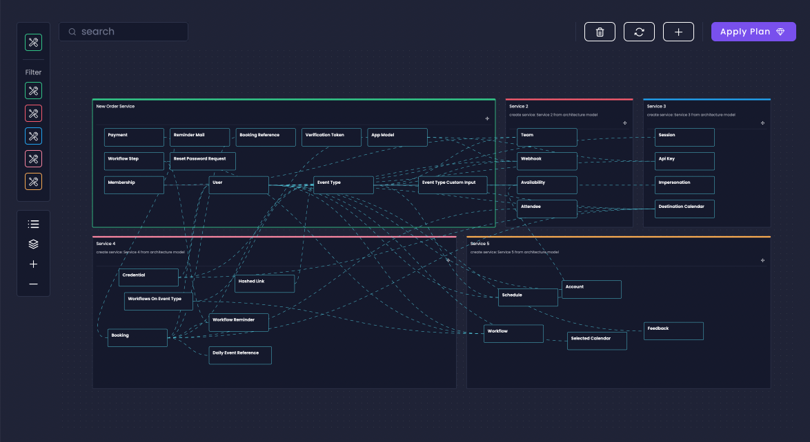

# Break The Monolith

Amplication's "Break The Monolith" feature helps you seamlessly update monolithic architectures into a modern, scalable, and maintainable microservice architecture.

It introduces a new project-level _Architecture_ tab to simplify the process of moving entities across different services.

This guide will walk you through the steps to effectively utilize Break The Monolith for improving your application's architecture.

:::note
The "Break The Monolith" feature is currently in beta and **available to Enterprise workspaces including trial workspaces**.
:::

## How To Use "Break The Monolith"

"Break The Monolith" focuses on the following 3 parts:

1. **Overview of Current Services**: Get a comprehensive view of your project's services, their entities, fields, and relationships with Overview mode.
2. **Redesign and Service Distribution**: <!-- Manually or with AI assistance, r--> Redesign your service and move entities between services to create a new micro-service structure.
3. **Confirm and Apply the New Architecture**: Amplication handles the creation of new services, moves entities, and manages the relationships between entities automatically. Each service comes complete with their entities, APIs, and data models, to support the new microservice architecture to your code is ready for production.

Let's review each of the various parts of this new feature specifically.

## Overview Mode

Overview mode is the view-only default mode for viewing your services and entities.

:::note
**Free users** have access to Overview mode _without_ the Redesign capabilities.
:::

Overview Mode introduces several UI components to ease navigating throughout the interface.

### Service Filter

On the upper left-side of the Architecture tab is the filter component and the associated search bar.

Each individual colored button with an icon represents one of your services. _Hover_ over the button to see the name of your service. _Click_ the button to hide/show the service.

The associated search field helps you search through your services by name.

The filter is useful if you only need to handle or analyze specific services.

### UI Management Buttons

Directly below the Service Filter are various buttons to help you manage the drag-and-drop interface.

_Hover_ over each button to see the name of what the button does.

1. **Toggle Field List** toggles the associated field names for all the entities in your service.
2. **Reset Layout** resets the Zoom level back to normal.
3. **Zoom In** increases the Zoom level of the interface.
4. **Zoom Out** decreases the Zoom level of the interface.

## Redesign Mode

Redesign mode allows you to restructure services by facilitating the movement of entities between them using our drag-and-drop interface.

Click on the **Redesign** button to enter Redesign Mode and select a service to redesign.

:::note
You can redesign only **one** service at a time.
:::

You can move entities between services in two ways:

1. Drag and drop entities into the appropriate service.
2. Select multiple entities using the dedicated menu or the command/control button and move them in bulk to create micro-services.

Redesign mode introduces a few more buttons to help you while redesigning your service.

1. **Add New Service** creates a new service so that you can drag-and-drop entities between 
2. **Fetch Updates From Server** gets any updates from the server. This is useful in case updates were made during the monolith redesign process.
3. **Discard Changes** discards all the Redesign changes and brings you back into Overview Mode.
4. **Apply Plan** applies your changes and brings you to the confirmation screen.

:::note
Changes made in Redesign Mode are auto-saved, but they're not applied or visible to other team members until you click the **Apply** button.
:::

<!--
### Step 3: Utilize AI for Smart Architecture Suggestions (Optional)

The "Break the Monolith" button, available in the Project and Service Overview screens, triggers AI analysis to suggest an efficient new microservice architecture, including service distribution and entity organization. Review the AI's recommendations before making any changes.

:::note
**This feature uses LLMs to analyze and suggest ideal microservices structures**. It requires sharing details of your entities and fields with LLMs for analysis. We ensure the highest privacy standards and use your data only to improve your project's architecture.
:::
-->

<!--
### Step 3: Utilize AI for Smart Architecture Suggestions (Optional)

The "AI Helper" button in the Architecture tab, also available in both the Project and Service Overview screens as "Break The Monolith" button, offer AI-driven suggestions for transforming services into an efficient microservice architecture. Select a service to initiate AI analysis, which includes service distribution and entity organization recommendations.

:::note
**This feature uses advanced LLMs for optimal microservices structuring suggestions**. Only anonymous data is shared during analysis, and it occurs exclusively when users proactively engage features utilizing LLMs. Users can opt out of LLM features, maintaining control over their data privacy.
:::
-->

<!--
## Starting with Prisma Schema in Break The Monolith

Start with our [Import Prisma Schema](/how-to/import-prisma-schema) feature to leverage your existing database schemas instead of manually creating entities. Rapidly transition to optimized microservice configurations saving you even more time.

This approach allows you to import your existing database structure into Amplication, where the Intelligent AI Helper can then suggest optimal microservice configurations.

To get started with your Prisma schema upload, visit our [Import Prisma Schema](/how-to/import-prisma-schema) documentation for step-by-step instructions.
-->

## Architecture Change Confirmation

Once you're satisfied with the changes, use the **Apply Plan** button to update your project's architecture.

The dialog will let you confirm the creation of new services with default settings and the reallocation of specific entities to those services.

:::note
Existing entity permissions **do not get moved over** to the new service structure with Break The Monolith. The permissions with your entities will need manual reassignment.

Learn [how to set access permissions](/how-to/set-access-permissions/#set-entity-permissions) for your entities.
:::

After applying changes in the Architecture tab, the "Pending Changes" section of your dashboard will reflect those updates. If everything looks good, click on the **Commit Changes & Build** button and Amplication will automatically create a new PR to your git provider containing your changes towards a micro-services architecture.

## Learn the Technical Workings of Break The Monolith

For a deeper understanding of the technical details behind "Break The Monolith" and how it transforms your monolithic architecture into microservices, visit our detailed technical guide on the [Understanding Break The Monolith](/how-to/understanding-break-the-monolith) page.

<!-- 
## Explore "Break The Monolith" in Our Interactive Sandbox

"Break The Monolith" can also be explored in a sandbox environment on Amplication's website. This environment lets you experience the feature before applying it to your services. You can experiment with a set of predefined entities and open-source repositories structured as monoliths.
-->