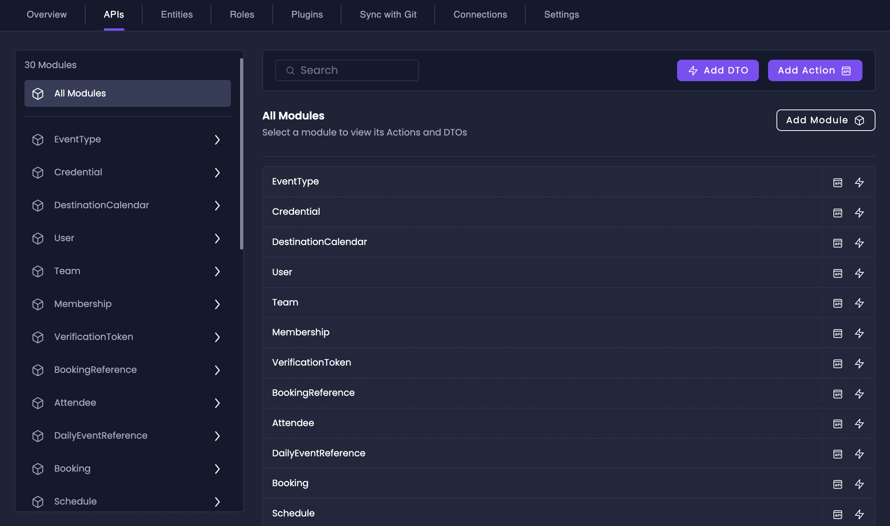
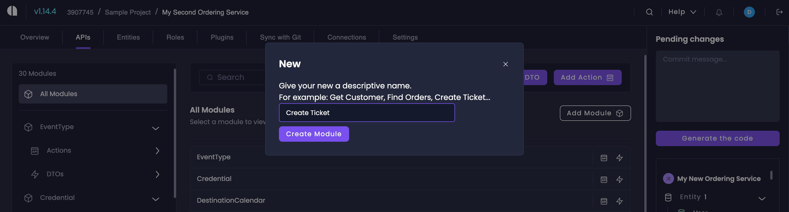
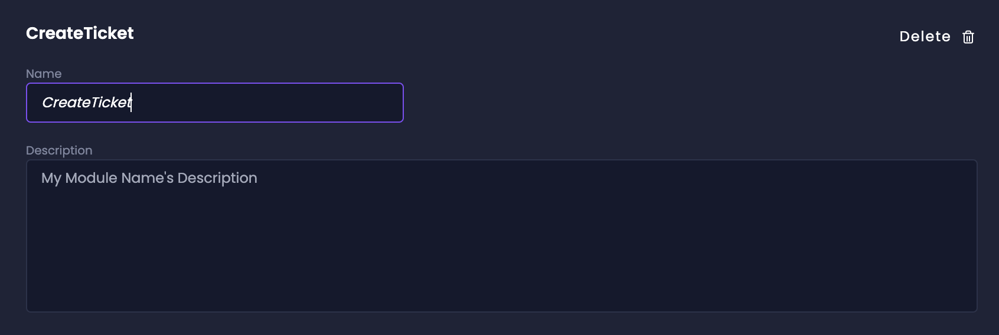
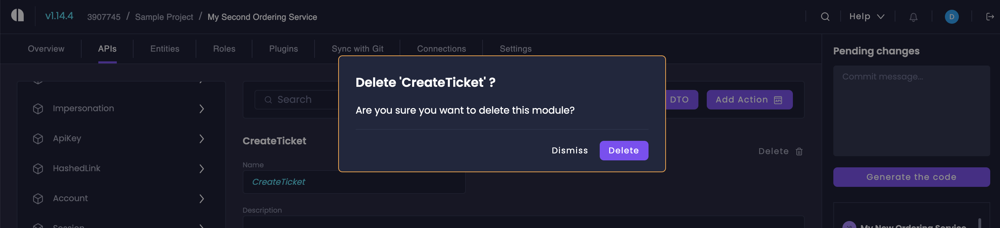
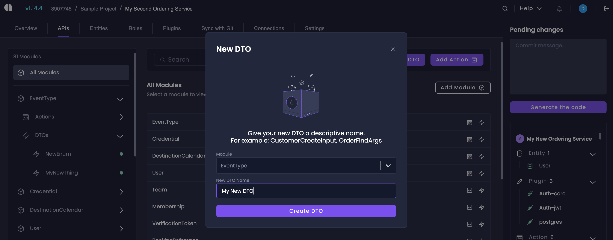
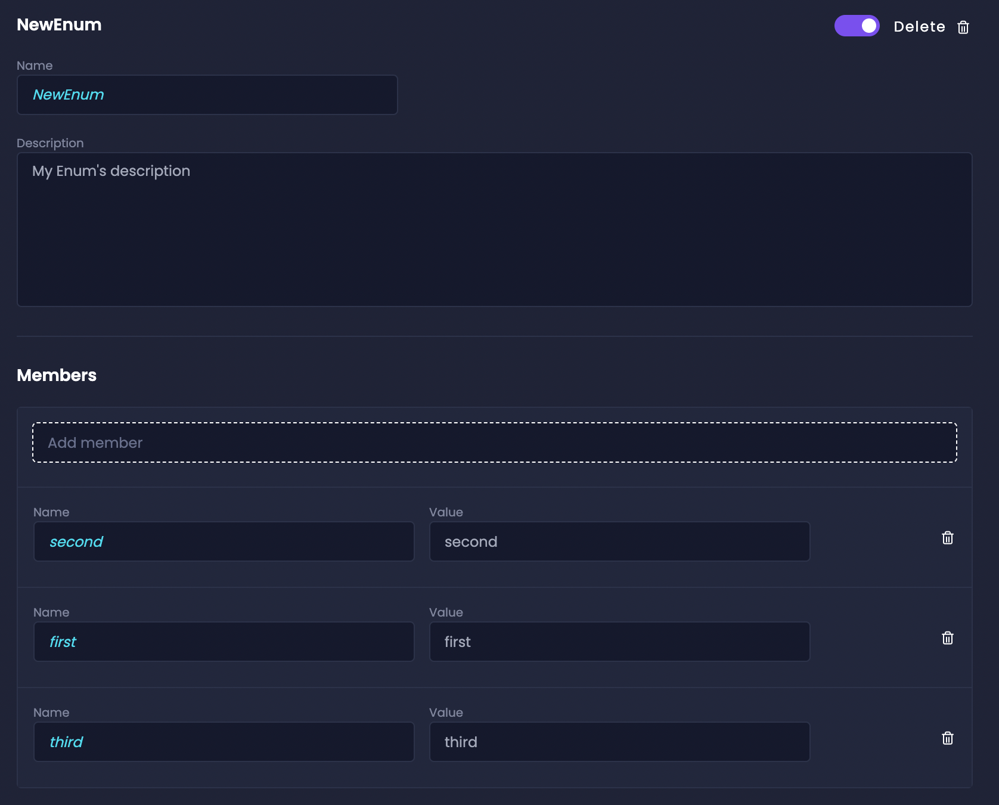
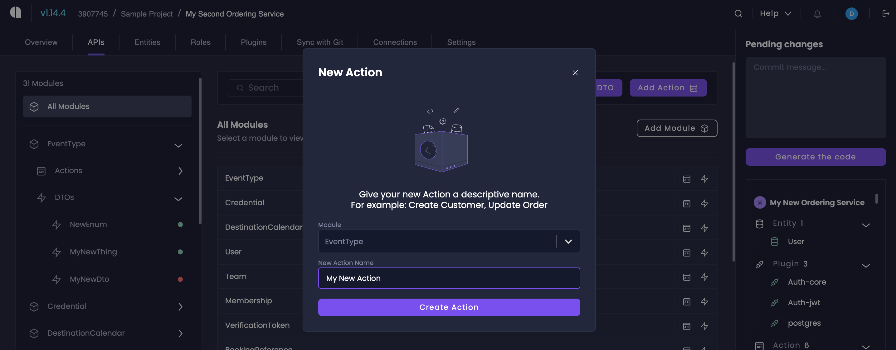
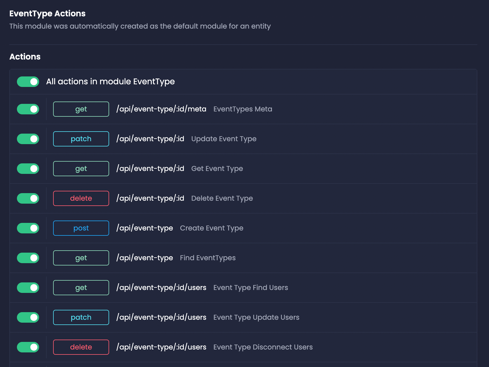
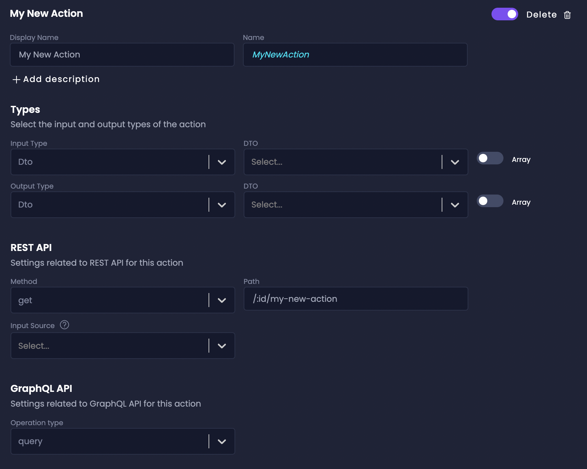

# Custom Types & Actions

Custom Types & Actions is an enhanced feature that gives you full control over your Data Transfer Objects (DTOs) and APIs. It allows you to automatically generate high-quality, efficient code for your REST and/or GraphQL APIs.

Custom Types & Actions let you define custom data structures, create API endpoints, and manage the relationships between them, all within the Amplication UI.

:::note
The Custom Types & Actions feature is available for Amplication's **Enterprise** plan.
:::

## Accessing Custom Types & Actions

To access the Custom Types & Actions feature, navigate to the new **APIs** tab in your Amplication dashboard. This tab provides a centralized view of all your project's Modules, DTOs, and Actions.

The APIs tab is divided into sections for each Module, making it easy to browse and manage your application's custom types and actions.

## Modules

Modules are organizational units that group related DTOs and Actions together. They help structure your application in a logical and maintainable way. Modules are closely tied to entities in your application, allowing you to keep related functionality together.

### Create Module

To create a new Module, follow these steps:

1. In the APIs tab, click on "All Modules" in the sidebar.
2. Click on the "Add Module" button.
2. Provide a name for your Module.
3. Click the "Create Module" button to finalize the creation process.

### Edit Module

To edit an existing Module, follow these steps:

1. In the APIs tab, locate the Module you want to edit.
2. Click on the Module name to open the Module details page.
3. Click on the "Edit Module" button to open the Module edit page.
3. Modify the Module name and description as needed.
4. Your changes will be saved automatically.

### Delete Module

To delete a Module, follow these steps:

1. In the APIs tab, locate the Module you want to delete.
2. Click on the Module name to open the Module details page.
3. Click on the "Edit Module" button to open the Module edit page.
4. Click the delete icon next to the Module name.
5. Confirm the deletion when prompted.

:::danger
Deleting a Module will also delete all the DTOs and Actions within that Module. Exercise caution when deleting Modules.
:::

## DTOs and Enums

Data Transfer Objects (DTOs) define the structure and format of data that is transferred between different parts of your application, particularly between the client and the server, or between different services within the application.

In Amplication, DTOs serve several purposes:

- They define the input and output data structures for API endpoints (Actions).
- They can be used as request and response bodies for REST APIs.
- They can be used as input types (arguments) and return types for GraphQL APIs.

Amplication provides built-in DTOs for common use cases, such as pagination, sorting, and filtering. These DTOs are automatically generated based on your application's entities. However, you can also create custom DTOs to suit your specific requirements.

### Differences between DTOs and Enums

Enums are used to define a fixed set of constants. DTOs are used to define the structure and shape of data objects that are transferred between different parts of the project.

In Amplication, you can create and manage both enums and DTOs using the Custom Types & Actions feature, allowing you to define the data contracts and constraints for your application's API endpoints.

### Create DTO

To create a new DTO, follow these steps:

1. Click on the "Add DTO" button in the top right of the APIs tab.
2. In the dropdown, click on "Add DTO".
3. Provide a name for your DTO.
4. Click the "Create DTO" button to finalize the creation process.

### Edit, Disable, and Delete DTO

To edit an existing DTO, click on the DTOs dropdown within its associated Module in the APIs tab. You can modify the DTO's name, description, and members.

To disable an existing DTO, click on the toggle and move it into the disabled state. The dot in the left sidebar will now change colors into Red. You won't be able to use this DTO within the module.

To delete a DTO entirely, click on the delete button next to the toggle. A confirmation popup will appear. Click on the delete button again to fully delete the DTO.

:::note
Be cautious when deleting DTOs, as it may impact other parts of your application that depend on them.
:::

## Actions

Actions represent the API endpoints that define the operations available in your application. They specify the HTTP methods, paths, input, and output data structures for each endpoint.

Actions use DTOs to define their input and output data. Each Action can have a request DTO (for input) and a response DTO (for output). Amplication generates built-in Actions based on your application's entities, but you can also create custom Actions to implement specific functionality.

### Create Action

To create a new Action, follow these steps:

1. Click on the "Add Action" button in the top right of the APIs tab.
2. Provide a name for your new Action.
3. Click the "Create Action" button to finalize the creation process.

### Enable and Disable Actions

Amplication gives you a complete overview of all Actions associated with a specific Module.

This is useful when you want to temporarily disable certain endpoints without completely removing them from your application.

To enable or disable an Action, simply toggle the switch next to the Action's name in the APIs tab.

### Edit and Delete Action

Similar to DTOs, you can edit, delete, move, and duplicate Actions within the APIs tab. When editing an Action, you can modify its HTTP method, path, input DTO, output DTO, and other settings as needed. Remember to save your changes when you're done.

## Conclusion

Custom Types & Actions in Amplication provide a powerful and flexible way to define and manage your application's data structures and API endpoints. By leveraging custom DTOs and Actions, you can create a tailored and efficient API that meets your specific requirements.