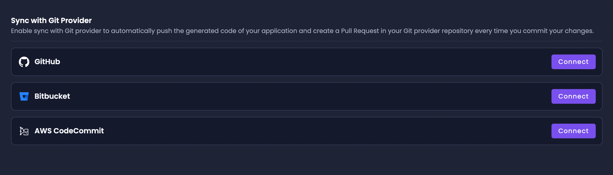

# Enterprise Git Providers

Amplication extends its support beyond GitHub to include additional Git providers like [Bitbucket](/sync-with-bitbucket), GitLab, and [AWS CodeCommit](/sync-with-aws-codecommit) for users on the Enterprise plan.
Organizations can integrate with their git provider to leverage the Git workflows they are already accustomed to.

:::note
Access to more git providers is only **available for Enterprise Plan users**.
Get temporary access during your 7-day Enterprise plan trial for new workspaces.
Free plan users get access to [GitHub](/sync-with-github).
:::

## Available Git Providers

Apart from GitHub, Amplication's Enterprise plan users can choose to integrate with the following Git providers:

- [**Bitbucket**](/sync-with-bitbucket): Ideal for teams already using Atlassian products, offering seamless integration with Jira and Trello.
- [**AWS CodeCommit**](/sync-with-aws-codecommit): A fully-managed source control service that hosts secure Git-based repositories, perfect for users deeply integrated with the AWS ecosystem.
- **GitLab**: Integrates version control, CI/CD, and project management in a unified environment. Its self-hosting option and strong API support make it adaptable and scalable for diverse development needs.

## Benefits of Integrating with Enterprise Git Providers

- **Flexibility**: Connect with the Git provider that aligns with your organization's workflow and toolchain.
- **Control**: Maintain full ownership and control of your codebase, regardless of where it is hosted.
- **Security**: Leverage the security features offered by Bitbucket and AWS CodeCommit for your source code management.
- **Collaboration**: Utilize familiar pull request and code review processes to enhance team collaboration and code quality.

## Changing Git Providers

Switching between Git providers on Amplication is straightforward and can be managed per service or at the project level. Here's how to change your Git provider for an existing service:

1. Navigate to your service's dashboard on Amplication.
2. Access the _Sync with Git Provider_ section via the sidebar or the project's dashboard.
3. Click on the `Select organization` dropdown.
4. To add a new organization or account, click on the `Add Organization` button at the bottom of the dropdown.
5. In the _Select Git Provider_ modal, choose your new Git provider and click `Connect`.
6. Follow the authorization steps required by the selected Git provider to allow Amplication access.
7. Once authorized, select an existing repository from the list provided or create a new repository through the modal.

For detailed instructions on how to sync with Bitbucket, AWS CodeCommit, or GitLab please refer to their specific documentation pages on Amplication:

- [Sync with Bitbucket](/sync-with-bitbucket)
- [Sync With AWS CodeCommit](/sync-with-aws-codecommit)
- Sync With GitLab (Coming Soon)
