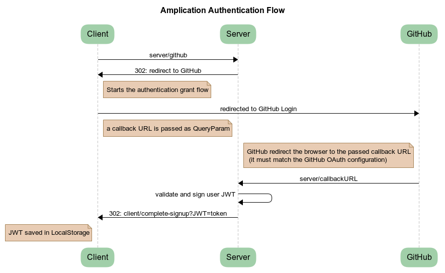
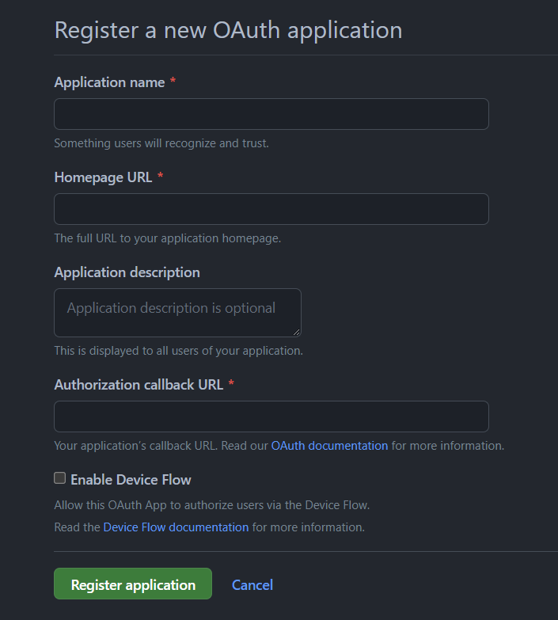
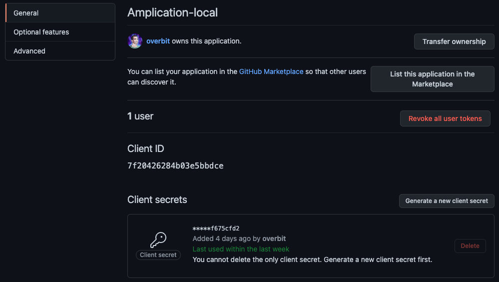

# Configure authentication with GitHub

Amplication client and server rely on GitHub OAuth mechanism to secure user interactions.

In order to configure GitHub auth and sync integration when running client and server locally,
you can follow the steps below.

## GitHub OAuth for user authentication



Amplication leverage GitHub OAuth implementation that supports the standard [authorization code grant type](https://www.rfc-editor.org/rfc/rfc6749#section-4.1).

### Step 1: Create a new GitHub OAuth App

1. Login in your GitHub account and create a new GitHub OAuth application [here](https://github.com/settings/applications/new)



2. Enter the fields as follows:
   - **Application name** - `[your-github-username]-amplication-local`
   - **Homepage URL** - `http://localhost:3001. _If you are hosting the Amplication client on any other address, use the specific address._
   - **Application description** - optional
   - **Authorization callback URL** - `http://localhost:3000`. _If you are hosting the Amplication server on any other address, use the specific address._
   - Post installation > **Setup URL** - `http://localhost:3001/github-auth-app/callback`. _If you are hosting the Amplication server on any other address, use the specific address._
3. Click Save.



4. Click `Generate new client secret` and copy the resulting secret


### Step 2: Configure Amplication server and client to work with the new GitHub app

5. Clone [/packages/amplication-server/.env](https://github.com/amplication/amplication/blob/master/packages/amplication-server/.env) into `/packages/amplication-server/.env.local`
6. Update `/packages/amplication-server/.env.local` with the following variables
   ```sh
   GITHUB_REDIRECT_URI=http://localhost:3000/github/callback
   GITHUB_CLIENT_ID="replace with the github auth application client id"
   GITHUB_CLIENT_SECRET="replace with secret created as step 4""
   ```
7. Clone [/packages/amplication-client/.env](https://github.com/amplication/amplication/blob/master/packages/amplication-client/.env) into `/packages/amplication-client/.env.local`
8. Update `/packages/amplication-client/.env.local` with the following variables
   ```sh
   NX_REACT_APP_GITHUB_AUTH_ENABLED=true
   NX_REACT_APP_GITHUB_CONTROLLER_LOGIN_URL=http://localhost:3000/github
   ```
9. Restart Amplication server and client.
