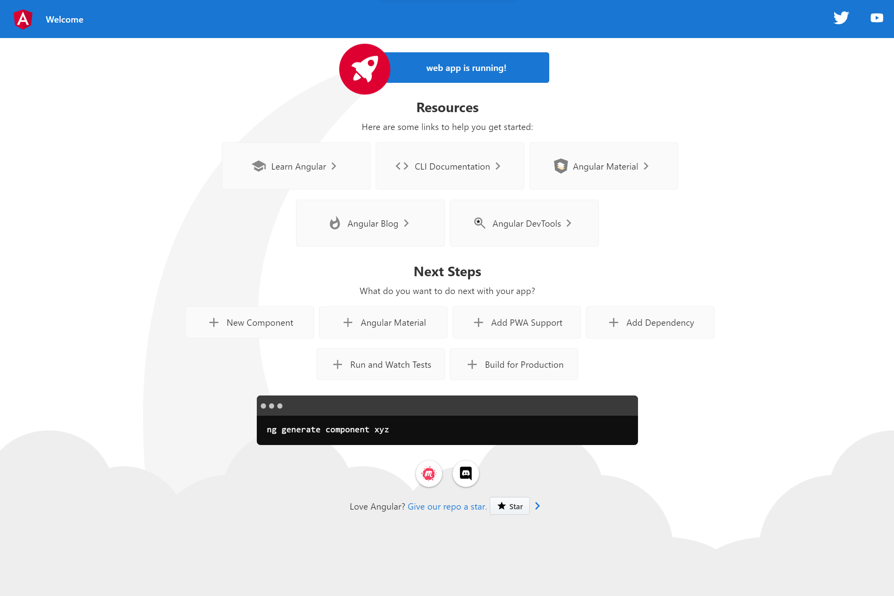
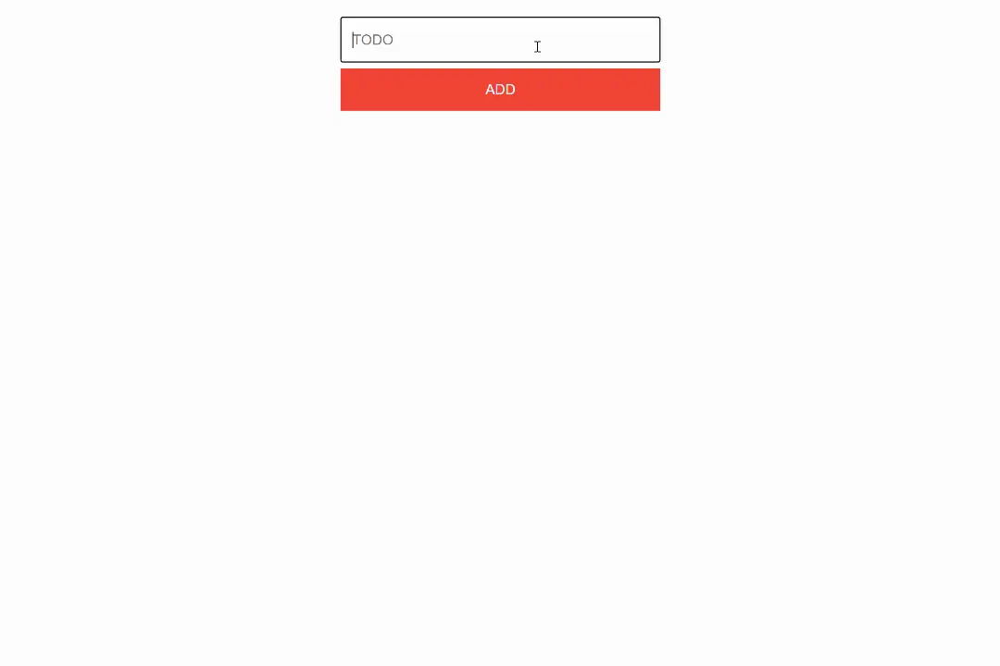

# Create the App

## Table of Contents

- [Step 1 - Creating a new directory](#step-1---creating-a-new-directory)
- [Step 2 - Starting with a blank canvas](#step-2---starting-with-a-blank-canvas)
- [Step 3 - Adding our components](#step-3---adding-our-components)
- [Step 4 - Putting it together](#step-4---putting-it-together)
- [Step 5 - Wrap Up](#step-5---wrap-up)

## Step 1 - Creating a new directory

`@angular/cli` will create a new directory for our frontend application as well as handle the heavy lifting of configuring all of our build tools.

1. Create a new folder to contain the frontend, and eventually the backend, application. Open a terminal window, navigate to the new folder, and run the commands:

```bash
npm i -g @angular/cli
ng new web -g -S --routing false --style css
```
> The above command creates a new Angular application with the following configuration:
> * Without initiating git (`-g` skips initiating git)
> * Without creating testing files (`-S` skips initiating test files)
> * Without setting up routing (`--routing false` tells the CLI not to setup the routing module)
> * With using CSS as the styling language (`--style css` tells the CLI to use CSS)

2. Next create a `package.json` file and copy into it the following:

```json
{
  "scripts": {
    "start": "npm --prefix web start",
    "postinstall": "npm ci --prefix web"
  }
}
```

3. Then create a `.gitignore` file and copy into it the following:

```txt
/node_modules
```

4. Finally return to the terminal and run the command:

```bash
npm run start
```

You'll be greeted by the following screen:



## Step 2 - Starting with a blank canvas

While the introductory application is nice, we'll want to start with a blank canvas.

1. Open up the root directory in the IDE of your choice.

2. Open `web/src/styles.css` and replace the content of this file with the following:

`web/src/styles.css`

```css
:root {
  --spacing: 4px;
  --font-size: 20px;
  --on-primary: #ffffff;
  --on-secondary: #ffffff;
  --primary: #f44336;
  --secondary: #2196f3;
  --text: #212121;
}

app-task {
  display: contents;
}

body {
  margin: 0;
  font-family: -apple-system, BlinkMacSystemFont, "Segoe UI", "Roboto",
    "Oxygen", "Ubuntu", "Cantarell", "Fira Sans", "Droid Sans",
    "Helvetica Neue", sans-serif;
  -webkit-font-smoothing: antialiased;
  -moz-osx-font-smoothing: grayscale;
}

button {
  border: none;
  background-color: var(--secondary);
  color: var(--on-secondary);
  font-size: var(--font-size);
  height: 60px;
  margin: var(--spacing) 0;
  max-width: 450px;
  width: 100%;
}

button[type="submit"] {
  background-color: var(--primary);
  color: var(--on-primary);
  text-transform: uppercase;
}

button:hover {
  filter: brightness(80%);
}

button:active {
  filter: brightness(120%);
}

code {
  font-family: source-code-pro, Menlo, Monaco, Consolas, "Courier New",
    monospace;
}

form {
  align-items: center;
  display: flex;
  flex-direction: column;
  margin: var(--spacing) 0;
  padding: calc(4 * var(--spacing));
}

input {
  background: transparent;
  border: 1px solid var(--text);
  border-radius: 3px;
  line-height: 30px;
  font-size: var(--font-size);
  margin: var(--spacing) 0;
  max-width: 416px;
  padding: calc(4 * var(--spacing));
  width: 100%;
}

input[type="checkbox"] {
  height: 48px;
  margin: var(--spacing);
  width: 48px;
}

li {
  display: flex;
  height: calc(48px + calc(2 * var(--spacing)));
  max-width: 450px;
  width: 100%;
}

li.completed {
  text-decoration: line-through;
}

span {
  flex: 1;
  font-size: var(--font-size);
  line-height: calc(48px + calc(2 * var(--spacing)));
}

ul {
  align-items: center;
  display: flex;
  flex-direction: column;
  list-style-type: none;
  padding: calc(4 * var(--spacing));
}
```

4. Then open `web/src/app/app.component.html` and delete all the content in this file.

## Step 3 - Adding our components

To build this todo list app, we'll need a few components.

### `Task`

Our first component will be used to render an individual task. We'll bind it to an `@Input()` element and an `@Output()` event:

- `@Input() task` - The task object itself. It has the following properties:
  - `text` - A string of the task itself.
  - `completed` - A boolean property that tracks if a task is completed.
  - `id` - A unique number to identify a task.
- `@Output() completed` - This event emitter will trigger a user taps on the checkbox, emitting the completed task id, and eventually toggling the state of the task.

In your terminal navigate to the `web` directory and run:

```bash
ng g c task
```

For the logic, replace the content of the TypeScript file with the following:

`web/src/app/task/task.component.ts`

```ts
import { Component, Input, Output, EventEmitter } from '@angular/core';

@Component({
  selector: 'app-task',
  templateUrl: './task.component.html',
  styleUrls: ['./task.component.css']
})
export class TaskComponent {
  @Input() task: any = {};
  @Output() completed = new EventEmitter<any>();
}
```

For the template, add the following code into the HTML file:

`web/src/app/task/task.component.html`

```html
<li [class.completed]="task.completed">
  <span>{{task.text}}</span>
  <input type="checkbox" [checked]="task.completed" (click)="completed.emit(task?.id)" readOnly />
</li>
```

### `Tasks`

Our second component will be used to render a list of tasks. We'll bind it to an `@Input()` element and an `@Output()` event:

- `@Input() tasks` - An array of tasks.
- `@Output() completed` - This event emitter will trigger a user taps on the checkbox in the `Task` component, bubbling the event up to the `AppComponent`,  and eventually will toggle the state of the task.

In your terminal navigate to the `web` directory and run:

```bash
ng g c tasks
```

For the logic, replace the content of the TypeScript file with the following:

`web/src/app/tasks/tasks.component.ts`

```ts
import { Component, Input, Output, EventEmitter } from '@angular/core';

@Component({
  selector: 'app-tasks',
  templateUrl: './tasks.component.html',
  styleUrls: ['./tasks.component.css']
})
export class TasksComponent {
  @Input() tasks: any[] = [];
  @Output() completed = new EventEmitter<any>();
}
```

For the template, add the following code into the HTML file:

`web/src/app/tasks/tasks.component.html`

```html
<ul>
  <app-task *ngFor="let task of tasks" [task]="task" (completed)="completed.emit($event)"></app-task>
</ul>
```

### `CreateTask`

The final component will be a form to allow users to create a new task. We'll bind it to an `@Output()` event:

- `@Output() addTask` - This event emitter will trigger on submission of the form and emits the new task they want to create.

Since we are working with a form element, we will need to add the `ReactiveFormsModule` to the `AppModule`. In `web/src/app/app.module.ts` make the following changes:

```diff
import { NgModule } from '@angular/core';
import { BrowserModule } from '@angular/platform-browser';
+ import { ReactiveFormsModule } from '@angular/forms';

import { AppComponent } from './app.component';
import { TaskComponent } from './task/task.component';
import { TasksComponent } from './tasks/tasks.component';

@NgModule({
  declarations: [
    AppComponent,
    TaskComponent,
    TasksComponent
  ],
  imports: [
-    BrowserModule
+    BrowserModule,
+    ReactiveFormsModule
  ],
  providers: [],
  bootstrap: [AppComponent]
})
export class AppModule { }
```

In your terminal navigate to the `web` directory and run:

```bash
ng g c create-task
```

For the logic, replace the content of the TypeScript file with the following:

`web/src/app/create-task/create-task.component.ts`

```ts
import { Component, Output, EventEmitter } from '@angular/core';
import { FormBuilder } from '@angular/forms';

@Component({
  selector: 'app-create-task',
  templateUrl: './create-task.component.html',
  styleUrls: ['./create-task.component.css']
})
export class CreateTaskComponent {
  @Output() addTask = new EventEmitter<string>();

  createTaskForm = this.fb.group({
    task: ''
  });

  constructor(private fb: FormBuilder) { }

  onSubmit() {
    if (!this.createTaskForm.valid) return;
    this.addTask.emit(this.createTaskForm.value.task);
    this.createTaskForm.reset();
  }
}
```

For the template, add the following code into the HTML file:

`web/src/app/create-task/create-task.component.html`

```html
<form [formGroup]="createTaskForm" (ngSubmit)="onSubmit()">
  <input
    type="text"
    placeholder="TODO"
    formControlName="task"
    required
  />
  <button type="submit">Add</button>
</form>
```

## Step 4 - Putting it together

With our different components created, we'll next put them together and see how they work!

1. Open up `web/src/app/app.component.ts` and in the `AppComponent` class we will want to create our tasks array and remove `title`.

   ```diff
   export class AppComponent {
   -  title = 'web';
   +  tasks: any[] = [];
   ```

2. We'll also want ways to add and toggle the state of tasks.

   ```diff
   export class AppComponent {
     tasks: any[] = [];
   
   +  createTask(text: string) {
   +    return {
   +      id: this.tasks.length,
   +      text,
   +      completed: false,
   +    };
   +  }
   +
   +  addTask(task: string) {
   +    const newTask = this.createTask(task);
   +    this.tasks.push(newTask);
   +  };
   +
   +  completed(id: number) {
   +    const i = this.tasks.findIndex((t) => t.id === id);
   +    this.tasks[i].completed = !this.tasks[i].completed;
   +  };
   }
   ```

3. With all of our logic and components in place, we'll finally render our components! Copy the following HTML into `web/src/app/app.component.html` so we can see our tasks list and add tasks to that list.

   ```html
   <app-create-task (addTask)="addTask($event)"></app-create-task>
   <app-tasks [tasks]="tasks" (completed)="completed($event)"></app-tasks>
   ```

## Step 5 - Wrap Up

Go ahead and try adding tasks or marking them as complete.



The only problem is that these tasks aren't being saved anywhere, so when you refresh the page _poof_ they're gone. In our next step, we will create our backend with Amplication to be able to save our tasks to a database!

To view the changes for this step, [visit here](https://github.com/amplication/angular-todos/compare/step-000...step-001).
