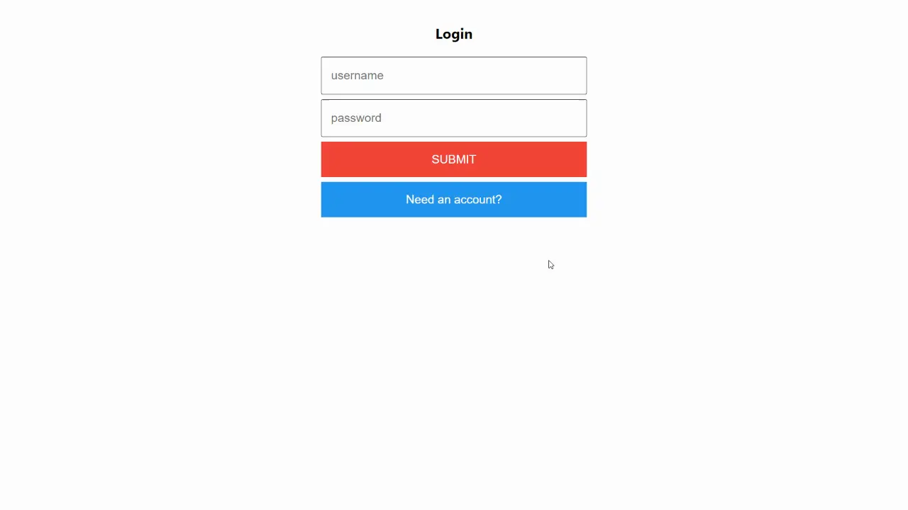

# Frontend Authentication

## Table of Contents

- [Step 1 - Add HttpClientModule](#step-1---add-httpclientmodule)
- [Step 2 - Authorization Requests](#step-2---authorization-requests)
- [Step 3 - The Auth Component](#step-3---the-auth-component)
- [Step 4 - Login](#step-4---login)
- [Step 5 - Wrap Up](#step-5---wrap-up)

## Step 1 - Add HttpClientModule

1. To allow users to sign in to the `Todos` application we'll need to prompt them for the username and password and then verify it with the backend. To make the HTTP request to the backend we'll use the Angular `HttpClientModule`. First open `web/src/app/app.module.ts` and add import the `HttpClientModule`:

   ```diff
   import { NgModule } from '@angular/core';
   import { BrowserModule } from '@angular/platform-browser';
   import { ReactiveFormsModule } from '@angular/forms';
   + import { HttpClientModule } from '@angular/common/http';
   ```

   Then add the `HttpClientModule` to the `imports` in the `@NgModule` decorator:

   ```diff
   @NgModule({
      declarations: [
         AppComponent,
         TaskComponent,
         TasksComponent,
         CreateTaskComponent
      ],
      imports: [
         BrowserModule,
         ReactiveFormsModule,
   +      HttpClientModule
      ],
    providers: [],
    bootstrap: [AppComponent]
   })
   export class AppModule { }
   ```

2. We'll want to abstract some variables, such as our API url, into a reusable resource. In `web/src/environments/environment.ts` and `web/src/environments/environment.prod.ts` add the following properties to the `environment` export:

   ```diff
   export const environment = {
      production: false,
   +   apiUrl: 'http://localhost:3000',
   +   jwtKey: 'accessToken',
   };
   ```

3. We'll want to configure the Angular `HttpClientModule` to use a user's access token when making requests to the backend and have easy access to the axios library, so we'll need to set up an interceptor as well as some other functions. In your terminal navigate to the `web` directory and run:

   ```bash
   ng g s JWT
   ```

4. Then replace the content of the generated file (`web/src/app/jwt.service.ts`) with the following code:

   ```ts
   import { Injectable } from "@angular/core";
   import {
     HttpInterceptor,
     HttpEvent,
     HttpRequest,
     HttpHandler,
   } from "@angular/common/http";
   import { Observable } from "rxjs";
   import { environment } from "../environments/environment";

   @Injectable({
     providedIn: "root",
   })
   export class JWTService implements HttpInterceptor {
     get jwt(): string {
       return localStorage.getItem(environment.jwtKey) || "";
     }

     set jwt(accessToken: string) {
       localStorage.setItem(environment.jwtKey, accessToken);
     }

     get isStoredJwt(): boolean {
       return Boolean(this.jwt);
     }

     intercept(
       request: HttpRequest<any>,
       next: HttpHandler
     ): Observable<HttpEvent<any>> {
       if (request.url.startsWith(environment.apiUrl)) {
         request = request.clone({
           setHeaders: { Authorization: `Bearer ${this.jwt}` },
         });
       }

       return next.handle(request);
     }
   }
   ```

   Now every request that the Angular `HttpClientModule` makes will take the user's JWT access token, which will be stored in local storage, and assign it to the Authorization header of every request.

   In addition we've added a `get`ter that checks if an access token already exists in local storage and a `set`ter to save an access token in local storage.

5. Finally we'll need to configure the `JWTService` in the `AppModule`. Open `web/src/app/app.module.ts` and import `JWTService` and `HTTP_INTERCEPTORS`:

   ```diff
   - import { HttpClientModule } from '@angular/common/http';
   + import { HttpClientModule, HTTP_INTERCEPTORS } from '@angular/common/http';

   + import { JWTService } from './jwt.service';

   import { AppComponent } from './app.component';
   ```

   Then add and configure the `JWTService` in the `providers` of the `@NgModule` decorator:

   ```diff
   -  providers: [],
   +  providers: [
   +     { provide: HTTP_INTERCEPTORS, useClass: JWTService, multi: true },
   +  ],
      bootstrap: [AppComponent]
   })
   export class AppModule { }
   ```

## Step 2 - Authorization Requests

Instead of calling our API endpoints directly from our components, we will abstract the logic of the requests so if we ever need to make changes to the behavior of the code we can do it in just one place.

1. In your terminal navigate to the `web` directory and run:

   ```bash
   ng g s auth
   ```

   And at the top of the newly created file (`web/src/app/auth.service.ts`), we'll import the `JWTService` and `HttpClient` and some other dependencies.

   ```diff
   import { Injectable } from '@angular/core';
   + import { HttpClient } from '@angular/common/http';
   + import { of } from 'rxjs';
   + import { catchError, mergeMap } from 'rxjs/operators';
   + import { JWTService } from './jwt.service';
   + import { environment } from '../environments/environment';
   ```

2. In the `AuthService` set the `JWTService` and `HttpClient` as arguments for the constructor:

   ```ts
   export class AuthService {
     constructor(private http: HttpClient, private jwt: JWTService) {}
   }
   ```

3. Now, add the `me` method:

   ```ts
   me() {
      const url = new URL('/api/me', environment.apiUrl).href;
      return this.jwt.isStoredJwt
         ? this.http.get(url).pipe(catchError(() => of(null)))
         : of(null);
   }
   ```

   `me` will check if we have an access token stored, because if there is none then there is no way this request would succeed. If the token exists, it will make a `GET` request to the `/api/me` endpoint we created in [Tutorial Step 3](../step-003). On the success of the request, the current user's user object will be returned.

4. Next, add the `login` method:

   ```ts
   login(username: string, password: string) {
      const url = new URL('/api/login', environment.apiUrl).href;
      return this.http
         .post(url, {
            username,
            password,
         })
         .pipe(
            catchError(() => of(null)),
            mergeMap((result: any) => {
               if (!result) {
                  alert('Could not login');
                  return of();
               }
               this.jwt.jwt = result.accessToken;
               return this.me();
            })
         );
   }
   ```

   `login` will make a `POST` request to the `/api/login` endpoint, sending the username and password of our user. If the request fails, like when a user doesn't exist, an alert will pop up notifying the user of the failure. If the request succeeds the access token will be saved into local storage, and then the `me` function will be called to return the current user's user object.

5. Then, add the `signup` method:

   ```ts
   signup(username: string, password: string) {
      const url = new URL('/api/signup', environment.apiUrl).href;
      return this.http
         .post(url, {
            username,
            password,
         })
         .pipe(
            catchError(() => of(null)),
            mergeMap((result: any) => {
               if (!result) {
                  alert('Could not sign up');
                  return of();
               }
               this.jwt.jwt = result.accessToken;
               return this.me();
            })
         );
   }
   ```

   `signup` will make a `POST` request to the `/api/signup` endpoint, which we also created in [Tutorial Step 3](../step-003), sending the username and password of our new user. If the request fails, like if the username is already used, an alert will pop up notifying the user of the failure. If the request succeeds the access token will be saved into local storage, and then the `me` function will be called to return the current user's user object.

6. Finally we'll need to add the `AuthService` to the `AppModule`. Open `web/src/app/app.module.ts` and import `AuthService`:

   ```diff
   + import { AuthService } from './auth.service';
   import { JWTService } from './jwt.service';
   ```

   Then add and configure the `AuthService` to the `providers` in the `@NgModule` decorator:

   ```diff
      providers: [
         { provide: HTTP_INTERCEPTORS, useClass: JWTService, multi: true },
   +      AuthService,
      ],
      bootstrap: [AppComponent]
   })
   export class AppModule { }
   ```

## Step 3 - The Auth Component

1. We need a component that can collect the username and password from the user and then make the appropriate request with the functions we just added. In your terminal navigate to the `web` directory and run:

   ```bash
   ng g c auth
   ```

2. Open the following files and replace the contents of those files with the following:

`web/src/app/auth/auth.component.ts`

```ts
import { Component, Output, EventEmitter } from "@angular/core";
import { FormBuilder } from "@angular/forms";
import { AuthService } from "../auth.service";

@Component({
  selector: "app-auth",
  templateUrl: "./auth.component.html",
  styleUrls: ["./auth.component.css"],
})
export class AuthComponent {
  @Output() setUser = new EventEmitter<string>();
  authForm = this.fb.group({
    username: "",
    password: "",
    confirm: "",
  });
  isLogin = true;

  constructor(private fb: FormBuilder, private auth: AuthService) {}

  onSubmit() {
    const { username, password, confirm }: { [key: string]: string } =
      this.authForm.getRawValue();

    if (!username || !password) return;

    let authResult;

    if (!this.isLogin && password !== confirm) {
      return alert("Passwords do not match");
    } else if (!this.isLogin) {
      authResult = this.auth.signup(username.toLowerCase(), password);
    } else {
      authResult = this.auth.login(username.toLowerCase(), password);
    }

    authResult.subscribe({ next: (result: any) => this.setUser.emit(result) });
  }
}
```

`web/src/app/auth/auth.component.html`

```html
<form [formGroup]="authForm" (ngSubmit)="onSubmit()">
  <h2>{{isLogin ? "Login" : "Sign Up"}}</h2>
  <input
    name="username"
    type="text"
    placeholder="username"
    formControlName="username"
    required
  />
  <input
    name="password"
    type="password"
    placeholder="password"
    formControlName="password"
    required
  />
  <input
    *ngIf="!isLogin"
    name="confirmPassword"
    type="password"
    placeholder="confirm password"
    formControlName="confirm"
    required
  />

  <button type="submit">Submit</button>
  <button type="button" (click)="isLogin = !isLogin">
    {{isLogin ? "Need an account?" : "Already have an account?"}}
  </button>
</form>
```

This component renders a form to the user prompting them for their username and password to log in. If they don't have an account yet then a button on the bottom of the page will toggle the form to be for creating a new account, which adds a new field for a user to confirm their password.

On submit the `login` or `signup` method from the `AuthService` is called, and the result is bubbled up by the `@Output() setUser` event emitter.

## Step 4 - Login

1. With the authentication component created we just need to show it to users. Start by adding a `user` property to the `AppComponent` in `web/src/app/app.component.ts` like:

   ```diff
   export class AppComponent {
      tasks: any[] = [];
   +   user: any;
   ```

2. Next we will add a method to the `AppComponent` to set the `user` property. While we could directly set the value, we will eventually want to trigger some code when a user is set, so we implement it this way.

   ```ts
   setUser(user: any) {
      this.user = user;
   }
   ```

3. Then update the `AppComponent`'s template (`web/src/app/app.component.html`) to look like this:

   ```html
   <ng-container *ngIf="user; else auth">
     <app-create-task (addTask)="addTask($event)"></app-create-task>
     <app-tasks [tasks]="tasks" (completed)="completed($event)"></app-tasks>
   </ng-container>

   <ng-template #auth>
     <app-auth (setUser)="setUser($event)"></app-auth>
   </ng-template>
   ```

   So, at the top level of the component's template we have two sibling elements, `<ng-container>` and `<ng-template>`. The behavior of `<ng-container>` is much like how `<>` is used in React, where we are holding elements without adding any extra elements to the DOM. The `<ng-container>` is displayed if the `user` property exists in the `AppComponent`, otherwise the content of the `<ng-template>` is shown. Inside `<ng-template>` we've added the `app-auth` element. When the `app-auth` element (`AuthComponent`) emits a `setUser` event the `user` property of the `AppComponent` is assigned by it's `setUser` method. If there is a `user` value then we'll toggle the template to show the todo list.

4. User's aren't expected to log in every time, especially considering we're storing the user's JWT access token. We'll update the `AppComponent` to call the `me` method of the `AuthService` when the component initiates. That way we can assign the `user` property as soon as possible.

   Start by importing `OnInit` and `AuthService`, and then set the `AppComponent` to implement the `OnInit` lifecycle hook.

   ```diff
   - import { Component } from '@angular/core';
   + import { Component, OnInit } from '@angular/core';
   + import { AuthService } from './auth.service';

   @Component({
      selector: 'app-root',
      templateUrl: './app.component.html',
      styleUrls: ['./app.component.css']
   })
   - export class AppComponent {
   + export class AppComponent implements OnInit {
   ```

   Next add a constructor where the `AuthService` is set as the only argument.

   ```ts
   constructor(private auth: AuthService) {}
   ```

   Then add this implementation of the `OnInit` lifecycle hook:

   ```ts
   ngOnInit(): void {
      this.auth.me().subscribe({ next: (user) => (this.user = user) });
   }
   ```

   Now if the `user` property has a value, which only occurs when they're logged in, the application will show the user's tasks. If the `user` property doesn't have a value they are shown the auth screen, which when a user logs in or signs up, will set the `user` property with the `setUser` event of the `app-auth` element (`AuthComponent`).

## Step 5 - Wrap Up

Run the application and try creating a new account.



Users are now able to login to the `Todos` application, but we're not saving their tasks in our backend yet... That'll have to be next.

To view the changes for this step, [visit here](https://github.com/amplication/angular-todos/compare/step-003...step-004).
