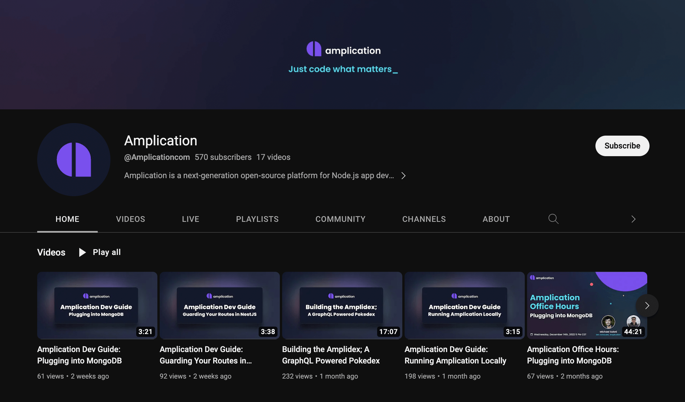

# Learn Amplication with Tutorials

To help you get started and learn Amplication in-depth we've put together some real world, step-by-step tutorials. We also have other learning resources for you on our YouTube channel and blog.

## Step-by-step Tutorials

We currently have two step-by-step tutorials that help you build apps with either Angular or React.

- [Angular Todos](/tutorials/angular-todos/): Build a todos app with Angular as your front-end and Amplication as your backend.
- [React Todos](/tutorials/react-todos/): Build a todos app with React as your front-end and Amplication as your backend.

## YouTube Developer Guides

If you prefer video, we have various developer guides on [our YouTube channel](https://www.youtube.com/c/Amplicationcom).

These includes guides like [Guarding your routes in NestJS](https://www.youtube.com/watch?v=nEkB3k0bJWc), [plugging into MongoDB](https://www.youtube.com/watch?v=4DYo6oJN8N4), and others.

## Amplication's blog

Finally, we also have various developer-focused posts up on [our blog](https://amplication.com/blog). 