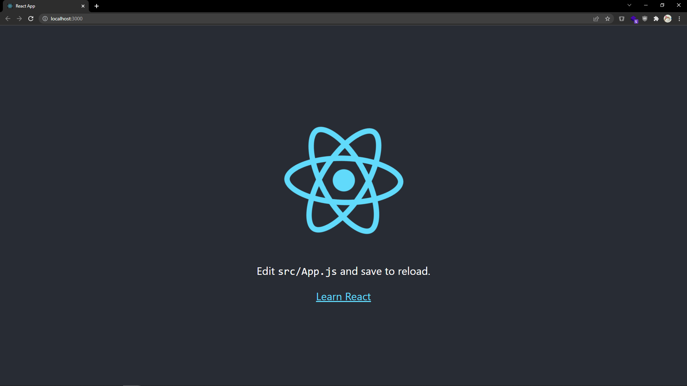
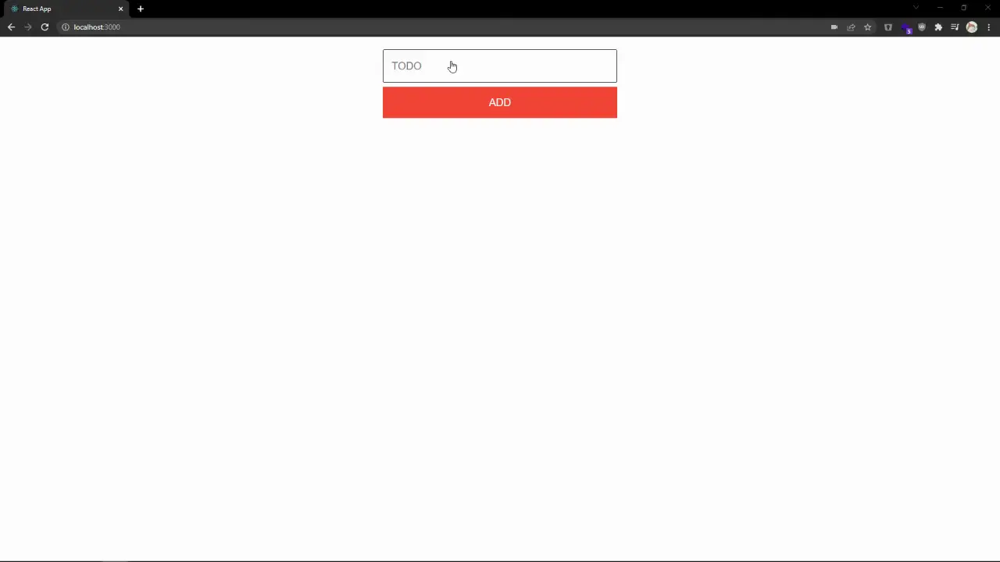

# Create the App

## Table of Contents

- [Step 1 - Creating a new directory](#step-1---creating-a-new-directory)
- [Step 2 - Starting with a blank canvas](#step-2---starting-with-a-blank-canvas)
- [Step 3 - Adding our components](#step-3---adding-our-components)
- [Step 4 - Putting it together](#step-4---putting-it-together)
- [Step 5 - Wrap Up](#step-5---wrap-up)

## Step 1 - Creating a new directory

`create-react-app` will create a new directory for our frontend application as well as handle the heavy lifting of configuring all of our build tools.

1. Create a new folder to contain the frontend, and eventually the backend, application. Open a terminal window, navigate to the new folder, and run the command:

```bash
npx create-react-app web
```

2. Next create a `package.json` file and copy into it the following:

```json
{
  "scripts": {
    "start": "npm --prefix web start",
    "postinstall": "npm ci --prefix web"
  }
}
```

3. Then create a `.gitignore` file and copy into it the following:

```txt
/node_modules
```

4. Finally return to the terminal and run the command:

```bash
npm run start
```

You'll be greeted by the following screen:



## Step 2 - Starting with a blank canvas

While the introductory application is nice, we'll want to start with a blank canvas.

1. Open up the `amplication-react` directory in the IDE of your choice.

2. Open up `web/src/App.css` and delete all the content in this file. Delete the file `web/src/logo.svg`.

3. Open `web/src/index.css` and replace the content of this file with the following:

`web/src/index.css`

```css
:root {
  --spacing: 4px;
  --font-size: 20px;
  --on-primary: #ffffff;
  --on-secondary: #ffffff;
  --primary: #f44336;
  --secondary: #2196f3;
  --text: #212121;
}

body {
  margin: 0;
  font-family: -apple-system, BlinkMacSystemFont, "Segoe UI", "Roboto",
    "Oxygen", "Ubuntu", "Cantarell", "Fira Sans", "Droid Sans",
    "Helvetica Neue", sans-serif;
  -webkit-font-smoothing: antialiased;
  -moz-osx-font-smoothing: grayscale;
}

button {
  border: none;
  background-color: var(--secondary);
  color: var(--on-secondary);
  font-size: var(--font-size);
  height: 60px;
  margin: var(--spacing) 0;
  max-width: 450px;
  width: 100%;
}

button[type="submit"] {
  background-color: var(--primary);
  color: var(--on-primary);
  text-transform: uppercase;
}

button:hover {
  filter: brightness(80%);
}

button:active {
  filter: brightness(120%);
}

code {
  font-family: source-code-pro, Menlo, Monaco, Consolas, "Courier New",
    monospace;
}

form {
  align-items: center;
  display: flex;
  flex-direction: column;
  margin: var(--spacing) 0;
  padding: calc(4 * var(--spacing));
}

input {
  background: transparent;
  border: 1px solid var(--text);
  border-radius: 3px;
  line-height: 30px;
  font-size: var(--font-size);
  margin: var(--spacing) 0;
  max-width: 416px;
  padding: calc(4 * var(--spacing));
  width: 100%;
}

input[type="checkbox"] {
  height: 48px;
  margin: var(--spacing);
  width: 48px;
}

li {
  display: flex;
  height: calc(48px + calc(2 * var(--spacing)));
  max-width: 450px;
  width: 100%;
}

li.completed {
  text-decoration: line-through;
}

span {
  flex: 1;
  font-size: var(--font-size);
  line-height: calc(48px + calc(2 * var(--spacing)));
}

ul {
  align-items: center;
  display: flex;
  flex-direction: column;
  list-style-type: none;
  padding: calc(4 * var(--spacing));
}
```

4. Then open `web/src/App.js` and replace the content in this file with below:

`web/src/App.js`

```js
import "./App.css";

function App() {
  return <div></div>;
}

export default App;
```

## Step 3 - Adding our components

To build this todo list app, we'll need a few components.

### `Task`

Our first component will be used to render an individual task. It takes in as parameters:

- `task` - The task object itself. It has the following properties:
  - `text` - A string of the task itself.
  - `completed` - A boolean property that tracks if a task is completed.
  - `id` - A unique number to identify a task.
- `toggleCompleted` - This function bubbles up when a user taps on the checkbox, toggling the state of the task.

Create the following file with this code.

`web/src/Task.js`

```js
import { useState } from "react";

export default function Task({ task, toggleCompleted }) {
  const [completed, setCompleted] = useState(task.completed);

  return (
    <li className={completed ? "completed" : "incompleted"}>
      <span>{task.text}</span>
      <input
        type="checkbox"
        checked={completed}
        onClick={() => toggleCompleted(task.id)}
        onChange={() => setCompleted(task.completed)}
        readOnly
      />
    </li>
  );
}
```

### `Tasks`

Our second component will be used to render a list of tasks. It takes in as parameters:

- `tasks` - An array of tasks.
- `toggleCompleted` - This function bubbles up when a user taps on the checkbox in the `Task` component, toggling the state of the task.

Create the following file with this code.

`web/src/Tasks.js`

```js
import Task from "./Task";

export default function Tasks({ tasks, toggleCompleted }) {
  return (
    <ul>
      {tasks.map((task) => (
        <Task key={task.id} task={task} toggleCompleted={toggleCompleted} />
      ))}
    </ul>
  );
}
```

### `CreateTask`

The final component will be a form to allow users to create a new task. It takes in as parameters:

- `addTask` - This function bubbles up when a user submits the form with the new task they want to create.

Create the following file with this code.

`web/src/CreateTask.js`

```js
import { useState } from "react";

export default function CreateTask({ addTask }) {
  const [task, setTask] = useState("");

  const handleChange = (e) => {
    setTask(e.target.value);
  };

  const handleSubmit = (e) => {
    e.preventDefault();
    addTask(task);
    setTask("");
  };

  return (
    <form onSubmit={handleSubmit}>
      <input
        type="text"
        placeholder="TODO"
        value={task}
        onChange={handleChange}
        required
      />
      <button type="submit">Add</button>
    </form>
  );
}
```

## Step 4 - Putting it together

With our different components created, we'll next put them together and see how they work!

1. Open up `web/src/App.js` and import React's `useState` function as well as our newly created `CreateTask` and `Tasks` components.

```diff
+ import { useState } from "react";
import "./App.css";

+ import CreateTask from "./CreateTask";
+ import Tasks from "./Tasks";
```

2. In the `App` function we will want to create our tasks array, so we'll use `useState` to create a reactive array.

```diff
function App() {
+ const [tasks, setTasks] = useState([]);
```

3. We'll also want ways to add and toggle the state of tasks.

```diff
function App() {
  const [tasks, setTasks] = useState([]);

+ const createTask = (text, id) => ({
+   id,
+   text,
+   completed: false,
+ });
+
+ const addTask = (task) => {
+   const temp = [...tasks];
+   temp.push(createTask(task, tasks.length));
+   setTasks(temp);
+ };
+
+ const toggleCompleted = (id) => {
+   let temp = [...tasks];
+   const i = temp.findIndex((t) => t.id === id);
+   temp[i].completed = !temp[i].completed;
+   setTasks(temp);
+ };
```

4. With all of our logic and components in place, we'll finally render our components! Replace the return statement with the following so we can see our tasks list and add tasks to that list.

```js
return (
  <div>
    <CreateTask addTask={addTask} />
    <Tasks tasks={tasks} toggleCompleted={toggleCompleted} />
  </div>
);
```

## Step 5 - Wrap Up

Go ahead and try adding tasks or marking them as complete.



The only problem is that these tasks aren't being saved anywhere, so when you refresh the page _poof_ they're gone. In our next step, we will create our backend with Amplication to be able to save our tasks to a database!

To view the changes for this step, [visit here](https://github.com/amplication/react-todos/compare/step-000...step-001).
