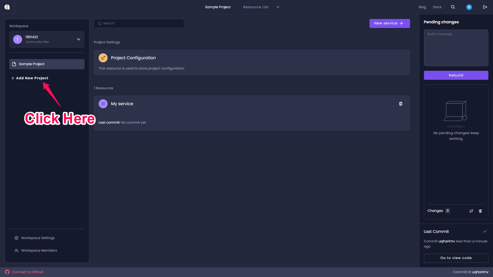
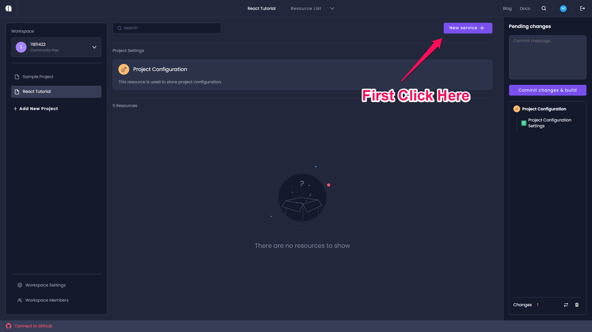
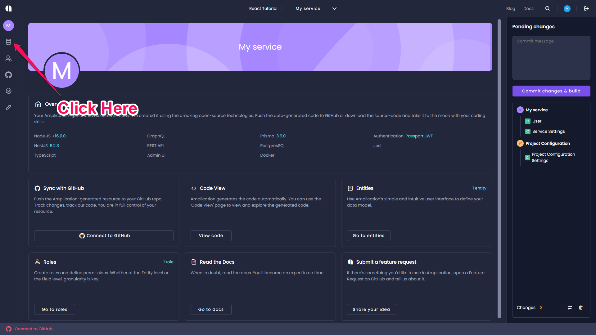
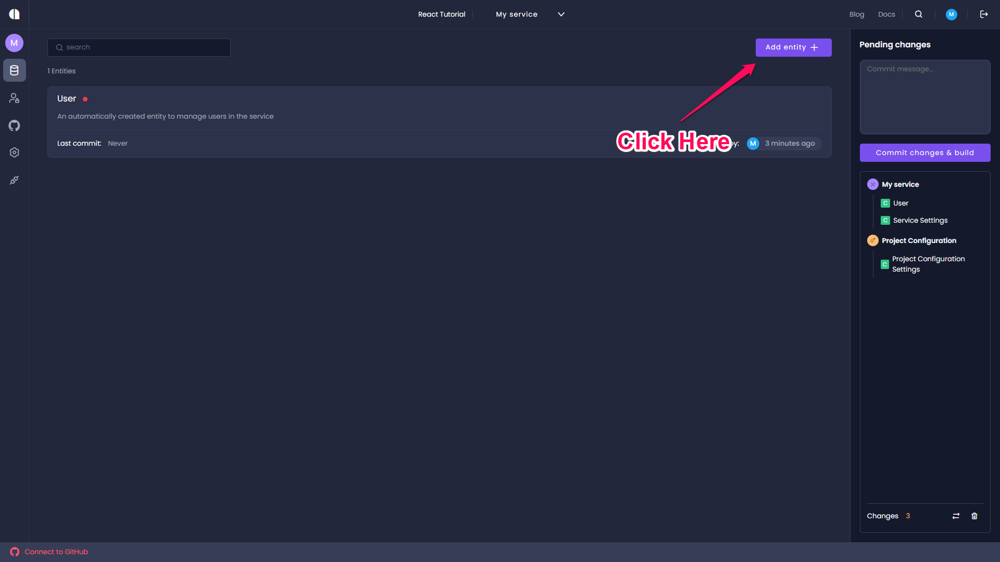
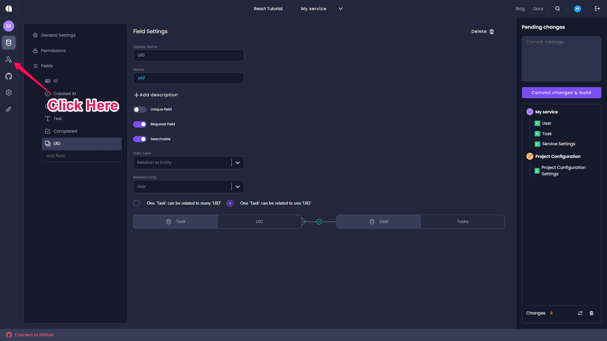
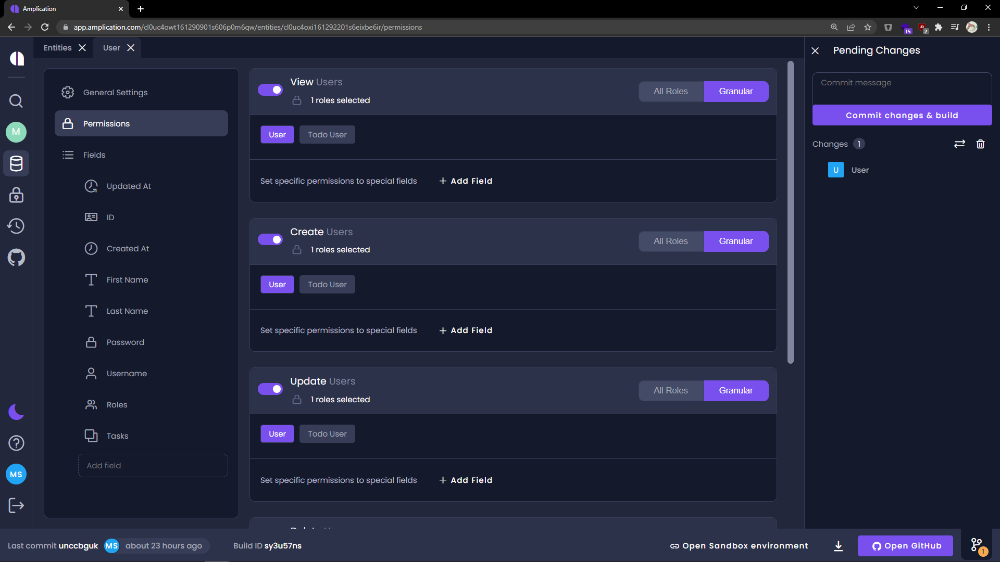
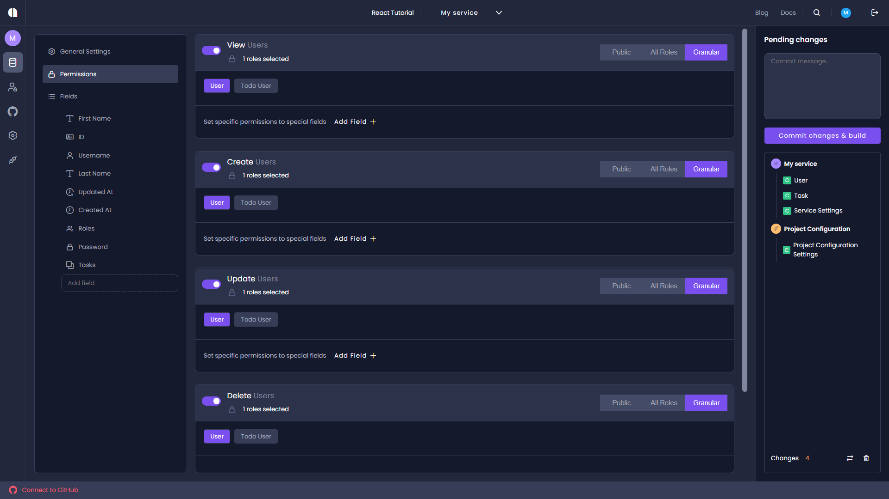

# Create the Backend

## Table of Contents

- [Step 1 - Create a New App](#step-1---create-a-new-app)
- [Step 2 - Create an Entity](#step-2---create-an-entity)
- [Step 3 - Create a Role](#step-3---create-a-role)
- [Step 4 - Assign Permissions](#step-4---assign-permissions)
- [Step 5 - Build the Backend](#step-5---build-the-backend)
- [Step 6 - Run the Backend](#step-6---run-the-backend)
- [Step 7 - Wrap Up](#step-7---wrap-up)

## Step 1 - Create a New App

1. Hopefully, you've had the chance to create an Amplication account, but if not, don't fret! Visit [https://app.amplication.com/](https://app.amplication.com/) and you'll be directed to the login screen. Here you can log in to an existing Amplication account, or create one, by signing in with a GitHub account.

   You should end up at the `New App` page, but if not you can get to it [here](https://app.amplication.com/).

2. Click the `New App` button in the top right corner.



3. Select `Start from Scratch` and wait a few seconds for the app to be generated.

   You'll be directed to the application's entities. An entity is  equivalent to a collection in a NoSQL database or a table in a  relational database.



By default, a User entity is created for you. This entity will eventually help us handle authentication. But first, let's deal with the backend.

## Step 2 - Create an Entity

The main entity will be used to store tasks created by users.

1. Click `Add entity`.


2. When a `New entity` modal appears, input `Task` into the input field and click `Create Entity`.

   With the entity created we'll want to define a few fields for task elements.

3. On the left-hand panel, you'll see the `Fields` this entity has, and at the very bottom, there will be an option to add a field.



4. The first field will be `Text`. Type that into the `Add field` input and hit `enter`.

   The new field will be created and a few options will appear.



5. Notice a dropdown for the `Data Type` of this field is set to `Single Line Text`. That's perfect as it'll be a string input of a task. There are many different data types Amplication can enforce for fields.

6. The only change that needs to be made here is this will be a required field. Toggle the `Required Field` switch.

   Changes will be automatically saved.

7. Like before, create a new field called `Completed`. This field should also be a required field, but we will change the data type. Click the `Data Type` dropdown and change this field to be a `Boolean`.

8. The final field we will need to create should be called `UID`. This field will be used to relate a task to a user. Mark this as a required field. In the `Data Type` dropdown select `Relation to Entity`.

9. The `Related Entity` dropdown should appear, select `User`. A modal asking to create a relation between a Task and a User will appear. Click `Create` to create the relation. To learn more about entity relations, there's an article on the docs website [here](https://docs.amplication.com/docs/relations/).

## Step 3 - Create a Role

Amplication allows for granular permission to create, read, update, and delete entries in the different entities of the backend.

User's who will be creating tasks in the Todo app will need to be granted certain permissions to create, read, and update their tasks and prevent them from doing other things.

1. Click the `Roles` icon on the left-hand panel.


2. Then, much like the properties, we added to the `Task` entity, create a role called `Todo User`.


## Step 4 - Assign Permissions

   With a role for users of the Todo app created, we'll want to assign certain permissions to the `Todo User`  role.

1. Click the `Entities` icon on the left-hand panel.

   

   By default, every role has CRUD (create, read, update, and delete) access to every entity. It is important  to limit the scope of our Todo users.

2. Select the `User` entity from the list of entities, and on the left-hand, panel select `Permissions`.

   Every type of command is granted to `All Roles`. Users with the `User` or `Todo User` role have full access to the `User` entity. This can be dangerous.

   The default admin account created by the backend has the role `User`, so we don't want to mess with that. What we will eventually do is have it so all new users are assigned the `Todo User` role, and we will limit their access to certain commands.

3. Toggle the permissions for each of the entity's commands to `Granular` and toggle on the `User` role. Now the only user who can access `User` accounts will have the `User` role, which will belong only to the admin account.



4. Return to the `Entities` page and now select the `Task` entity. Click `Permissions`. Toggle the `Delete` command, to `Granular` and enable access to the `User` role. Both `User`s (the admin) and `Todo User`s (regular users of the app) will be able to create, read, and update tasks; but only `User`s will be able to delete tasks.



## Step 5 - Build the Backend

With the new Task entity created, and a relation with User's created. We're now ready to build the backend.

On the right-side panel is the `Pending Changes` where the changes to `Task` and `User` will appear.


1. Click `Commit changes & build` to finalize the changes.

   Amplication by default creates a secure environment where all requests need to be authenticated. For this use case, we will want to ease some of those protections. Thanks to Amplication's extensibility, we can build on top of everything that was generated for us.

2. We'll start by downloading the backend. In the bottom right of the page, you'll see a download button. Click that and you'll download a `.zip` file containing all of the code to run the backend.

   

3. Extract the zip file and copy all of the contents (except for the `README.md`) to the root of the `amplication-react` project.

## Step 6 - Run the Backend

1. The `admin-ui` and `server` folders generated by Amplication are two new node projects that need to be set up. One thing both will need is their dependencies. In the `package.json` update the `postinstall` script:

   ```json
   "postinstall": "npm ci --prefix web && npm ci --prefix admin-ui && npm ci --prefix server"
   ```

2. Open a new terminal and run this command

   ```bash
   npm run postinstall
   ```

   This command will install the dependencies of all the subfolders. Another useful aspect of this command is that if you were to push this project to GitHub and cloned the repo when you run `npm install` this script will occur after the install to install the dependencies of the subfolders automatically.

3. There will be some minor conflicts with the code `create-react-app` created for us and the code Amplication created for us. This should be easy to correct though.Install `cross-env` and `npm-run-all` as a dev dependency as follows:

   ```bash
   npm install -D cross-env npm-run-all
   ```

4. Update the `start` script in `package.json` and add the following script as well:

   ```json
   "start": "npm-run-all -p start:frontend start:backend",
   "start:frontend": "cross-env PORT=5000 npm --prefix web start",
   "start:admin": "npm --prefix admin-ui start",
   "start:backend": "npm --prefix server start",
   ```

   By doing this the Todo app UI will now run on port `5000` during development so it won't conflict with Amplication's default port for the server (which is `3000`).

   We've also set the start to script to run our frontend and backend code at the same time.

5. Before starting the server there are a few additional steps required. Read `server/README.md` for directions to:

   - Create a Prisma client
   - Start a database in Docker
   - Initiate the database

6. When those steps have been completed run the following command:

   ```bash
   npm run start
   ```

## Step 7 - Wrap Up

The frontend of the Todo app will be running at [http://localhost:5000/](http://localhost:5000/), and the backend will be running at [http://localhost:3000/](http://localhost:3000/).

Visiting [http://localhost:3000/](http://localhost:3000/) will greet you with a `404` error. Instead, visit [http://localhost:3000/api/](http://localhost:3000/api/) to see all the endpoints of the backend and to see what our REST endpoints will look like.

With our backend created and running locally, we're almost ready to link it to the frontend. First, we'll need to make some additions to the code.

To view the changes for this step, [visit here](https://github.com/amplication/react-todos/compare/step-001...step-002).
