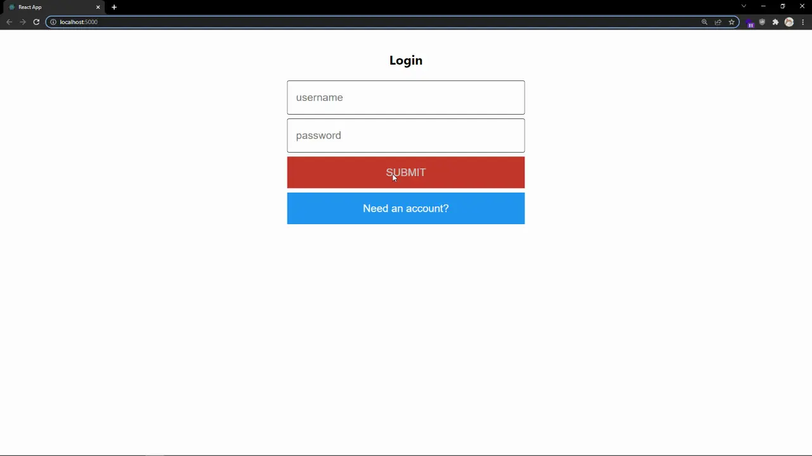

# Frontend Authentication

## Table of Contents

- [Step 1 - axios](#step-1---axios)
- [Step 2 - Authorization Requests](#step-2---authorization-requests)
- [Step 3 - The Auth Component](#step-3---the-auth-component)
- [Step 4 - Login](#step-4---login)
- [Step 5 - Wrap Up](#step-5---wrap-up)

## Step 1 - axios

1. To allow users to sign in to the `Todos` application we'll need to prompt them for the username and password and then verify it with the backend. To make the HTTP request to the backend we'll use a library called axios. First, install axios as a dependency in the `web` subfolder:

   ```bash
   cd web
   npm install axios
   ```

2. We'll want to configure axios to use a user's access token when making requests to the backend and have easy access to the axios library, so we'll need to set up an interceptor as well as some other functions. Create the following file `web/src/lib/http.js` and at the top of the file import axios.

   ```js
   import axios from "axios";
   ```

3. Then paste in the following code:

   ```js
   const apiUrl = "http://localhost:3000";
   const jwtKey = "accessToken";

   axios.interceptors.request.use(
     (config) => {
       const { origin } = new URL(config.url);
       const allowedOrigins = [apiUrl];
       const accessToken = localStorage.getItem(jwtKey);
       if (allowedOrigins.includes(origin)) {
         config.headers.authorization = `Bearer ${accessToken}`;
       }
       return config;
     },
     (error) => {
       return Promise.reject(error);
     }
   );
   ```

   Now every request that axios makes will take the user's JWT access token, which will be stored in local storage, and assign it to the Authorization header of every request.

4. To simplify some tasks we'll add a function that generates the full URL of an API request when provided the endpoint, a function that checks if an access token already exists in local storage, and a function to save an access token in local storage.

   ```js
   export const createUrl = (endpoint) => new URL(endpoint, apiUrl).href;
   export const isStoredJwt = () => Boolean(localStorage.getItem(jwtKey));
   export const setStoredJwt = (accessToken) =>
     localStorage.setItem(jwtKey, accessToken);
   ```

5. Finally, we'll want to expose the `get`, `patch`, and `post` methods axios provides.

   ```js
   export const get = axios.get;
   export const patch = axios.patch;
   export const post = axios.post;
   ```

## Step 2 - Authorization Requests

Instead of calling our API endpoints with axios directly from our components, we will abstract the logic of the requests so if we ever need to make changes to the behavior of the code we can do it in just one place.

1. Create the following file `web/src/lib/auth.js` and at the top of the file, we'll import some of the functions we created in the `web/src/lib/http.js` file.

   ```js
   import { createUrl, get, isStoredJwt, post, setStoredJwt } from "./http";
   ```

2. First, add the `me` function:

   ```js
   export const me = async () => {
     return isStoredJwt()
       ? (await get(createUrl("/api/me")).catch(() => null))?.data
       : null;
   };
   ```

   `me` will check if we have an access token stored, because if there is none then there is no way this request would succeed. If the token exists, it will make a `GET` request to the `/api/me` endpoint we created in [Tutorial Step 3](../step-003). On the success of the request, the current user's user object will be returned.

3. Next, add the `login` function:

   ```js
   export const login = async (username, password) => {
     const result = (
       await post(createUrl("/api/login"), { username, password }).catch(
         () => null
       )
     )?.data;

     if (!result) {
       return alert("Could not login");
     }
     setStoredJwt(result.accessToken);
     return me();
   };
   ```

   `login` will make a `POST` request to the `/api/login` endpoint, sending the username and password of our user. If the request fails, like when a user doesn't exist, an alert will pop up notifying the user of the failure. If the request succeeds the access token will be saved into local storage, and then the `me` function will be called to return the current user's user object.

4. Finally, add the `signup` function:

   ```js
   export const signup = async (username, password) => {
     const result = (
       await post(createUrl("/api/signup"), { username, password }).catch(
         () => null
       )
     )?.data;

     if (!result) {
       return alert("Could not sign up");
     }
     setStoredJwt(result.accessToken);
     return me();
   };
   ```

   `signup` will make a `POST` request to the `/api/signup` endpoint, which we also created in [Tutorial Step 3](../step-003), sending the username and password of our new user. If the request fails, like if the username is already used, an alert will pop up notifying the user of the failure. If the request succeeds the access token will be saved into local storage, and then the `me` function will be called to return the current user's user object.

## Step 3 - The Auth Component

1. We need a component that can collect the username and password from the user and then make the appropriate request with the functions we just added. Create `web/src/Auth.js` and paste the following code:

   ```js
   import { useState } from "react";
   import { login, signup } from "./lib/auth";

   export default function Auth({ setUser }) {
     const [isLogin, setIsLogin] = useState(true);
     const [username, setUsername] = useState("");
     const [password, setPassword] = useState("");
     const [confirm, setConfirm] = useState("");

     const handleUsernameChange = (e) =>
       setUsername(e.target.value.toLowerCase());
     const handlePasswordChange = (e) => setPassword(e.target.value);
     const handleConfirmChange = (e) => setConfirm(e.target.value);

     const handleSubmit = async (e) => {
       e.preventDefault();
       const func = isLogin ? login : signup;
       if (!isLogin) {
         if (password !== confirm) {
           return alert("Passwords do not match");
         }
       }
       const result = await func(username, password);
       setUser(result);
     };

     return (
       <div>
         <form onSubmit={handleSubmit}>
           <h2>{isLogin ? "Login" : "Sign Up"}</h2>
           <input
             name="username"
             type="text"
             placeholder="username"
             value={username}
             onChange={handleUsernameChange}
             required
           />
           <input
             name="password"
             type="password"
             placeholder="password"
             value={password}
             onChange={handlePasswordChange}
             required
           />
           {!isLogin && (
             <input
               name="confirmPassword"
               type="password"
               placeholder="confirm password"
               value={confirm}
               onChange={handleConfirmChange}
               required
             />
           )}
           <button type="submit">Submit</button>
           <button type="button" onClick={() => setIsLogin(!isLogin)}>
             {isLogin ? "Need an account?" : "Already have an account?"}
           </button>
         </form>
       </div>
     );
   }
   ```

   This component renders a form to the user prompting them for their username and password to log in. If they don't have an account yet then a button on the bottom of the page will toggle the form to be for creating a new account, which adds a new field for a user to confirm their password.

   On submit the `login` or `signup` function from `web/src/lib/auth.js` is called, and the result is passed into the `setUser` function.

## Step 4 - Login

1. With the authentication component created we just need to show it to users. Start by replacing the imports at the top of `web/src/App.js` with this:

   ```js
   import { useState, useEffect } from "react";
   import "./App.css";

   import { me } from "./lib/auth";

   import Auth from "./Auth";
   import CreateTask from "./CreateTask";
   import Tasks from "./Tasks";
   ```

2. Then create a `user` and `setUser` and add the following `useEffect` hook.

   ```diff
   function App() {
   +  const [user, setUser] = useState();
     const [tasks, setTasks] = useState([]);

   +  useEffect(() => {
   +    async function getUser() {
   +      const result = await me();
   +      setUser(result);
   +    }
   +    getUser();
   +  }, [setUser]);
   ```

   We've created our `user` variable and can update it with the `setUser` function. We've also implemented the `useEffect` hook, which will allow code to be executed when the component mounts. So, when the `App` component mounts, we call the `me` function from `web/src/lib/auth.js` to set the current user to our `user` variable.

3. Finally, replace the `return` with this:

   ```js
   return (
     <div>
       {user ? (
         <div>
           <CreateTask addTask={addTask} />
           <Tasks tasks={tasks} toggleCompleted={toggleCompleted} />
         </div>
       ) : (
         <Auth setUser={setUser} />
       )}
     </div>
   );
   ```

   Now if a `user` object exists, which only occurs when they're logged in, the application will show the user's tasks. If a `user` object doesn't exist they are shown the auth screen, which when a user logs in or signs up, will set the `user` variable with the `setUser` function that is passed into it.

## Step 5 - Wrap Up

Run the application and try creating a new account.



Users are now able to login to the `Todos` application, but we're not saving their tasks in our backend yet... That'll have to be next.

To view the changes for this step, [visit here](https://github.com/amplication/react-todos/compare/step-003...step-004).
