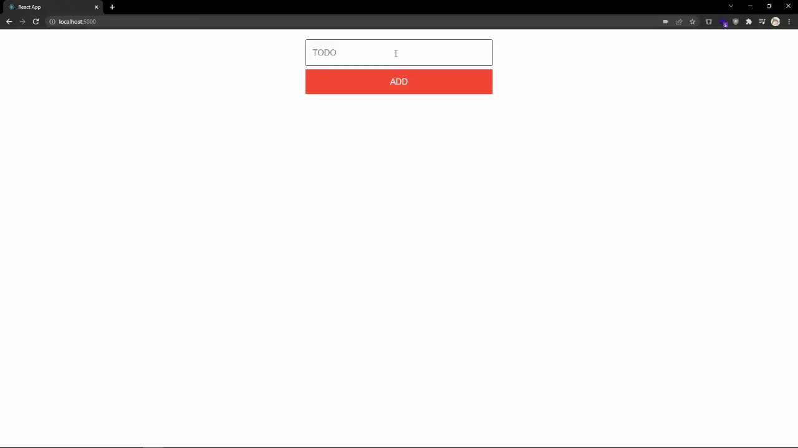

# Saving Tasks to the Backend

## Table of Contents

- [Step 1 - HTTP Requests](#step-1---http-requests)
- [Step 2 - Updating App](#step-2---updating-app)
- [Step 3 - Updating Auth](#step-3---updating-auth)
- [Step 4 - Updating Task](#step-4---updating-task)
- [Step 5 - Wrap Up](#step-5---wrap-up)

## Step 1 - HTTP Requests

Users can log in to their accounts, but their tasks are still not persisting. What users will require is the ability to create tasks, mark tasks as complete, and view all of their existing tasks.

We will need a new dependency though, `qs`, in the `web` subfolder. `qs` is the library we use to stringify an object for `GET` requests.

   ```bash
   cd web
   npm install qs
   npm install -D @types/qs
   ```

We'll create functions to handle these requests in a new file, create `web/src/lib/tasks.js`, and at the top of the file, we'll import some of the functions we created in the `web/src/lib/http.js` file as well as the `qs` library.

   ```js
   import qs from "qs";
   import { createUrl, get, patch, post } from "./http";
   ```

1. First, add the `create` function:

   ```js
   export const create = async (text, uid) => {
     const result = (
       await post(createUrl("/api/tasks"), {
         completed: false,
         text,
         uid: { id: uid },
       }).catch(() => null)
     )?.data;

     if (!result) {
       return alert("Could not create task");
     }

     return result;
   };
   ```

   `create` will take two arguments, the text content of a new task as well as the unique ID of the user. It will make a `POST` request to the `/api/tasks` endpoint, sending a task object. The task object has three properties:

   - `completed`- A boolean property that tracks if a task is completed. It's being assigned to false here by default as a new task will not be completed already.
   - `text` - The string of the task itself.
   - `uid.id` - The unique ID of the user, this allows for querying tasks created by a specific user.

   One property that is not being included that we had before is `id`. Why aren't we assigning it? Well, we don't need to. The Amplication backend will assign a unique ID to all entries to the database, making management of data easier.

   If the request fails an alert will notify the user and the function will not return anything. On the success of the request, the new task object will be returned, with all the required properties to render it in the frontend.

2. Next, add the `getAll` function:

   ```js
   export const getAll = async (uid) => {
     const query = qs.stringify({
       where: { uid: { id: uid } },
       orderBy: { createdAt: "asc" },
     });
     const result = (await get(createUrl(`/api/tasks?${query}`)).catch(() => null))
       ?.data;

     if (!result) {
       alert("Could not get tasks");
       return [];
     }

     return result;
   };
   ```

   `getAll` takes one argument, the unique ID of the user. It will make a `GET` request to the `/api/tasks` endpoint, sending a query. In this case, we're looking to return all the tasks for a user, and the query object reflects that. Looking at the object should help make sense of what's going on.

   In the query, `{ where: { uid: { id: uid } } }`, we're telling the backend that we are looking for all entities `where` the `uid` value of a task is set to the unique ID of a user. Additionally, in the query there is `{ orderBy: { createdAt: "asc" } }`, which returns the tasks in the order they were created, from oldest to newest (`asc`ending). `createdAt` is a property that Amplication adds to all database entries by default. If the request fails, an alert will pop up notifying the user of the failure. If the request succeeds,  then all tasks created by a user will be returned as an array.

3. Finally, add the `update` function:

   ```js
   export const update = async (task) => {
     const result = (
       await patch(createUrl(`/api/tasks/${task.id}`), {
         completed: !task.completed,
       }).catch(() => null)
     )?.data;

     if (!result) {
       return alert("Could not update task");
     }

     return result;
   };
   ```

   `update` takes one argument, the task object. It will make a `PATCH` request to the `/api/tasks/{TASK_ID}` endpoint. The ID of the task object is included in the request and all that is being sent in the body of the request is a `completed` property, which is toggled to its new state. `PATCH` requests do not require a complete object, and only update the properties included in the request. In this case, we only want to update the `completed` property, so that's the only value we send. If the request fails an alert will pop up notifying the user of the failure. If the request succeeds then the updated task object will be returned.

## Step 2 - Updating App

Presently `web/src/App.js` is handling the state of the user's tasks. Start by importing `web/src/lib/tasks.js` into `web/src/App.js`.

```js
import * as tasksLib from "./lib/tasks";
```

1. In the `App` function we can now remove the `createTask`, as the task object is created by the `create` function in the `web/src/lib/tasks.js` file.

   ```diff
   - const createTask = (text, id) => ({
   - id,
   - text,
   - completed: false,
   - });

   const addTask = (task) => {
     const temp = [...tasks];
     temp.push(createTask(task, tasks.length));
     setTasks(temp);
   };
   ```

2. We'll next modify the `addTask` function:

   ```diff
   - const addTask = (task) => {
   + const addTask = async (task) => {
   +  const newTask = await tasksLib.create(task, user.id);
   +  if (!newTask) return;
     const temp = [...tasks];
   -  temp.push(createTask(task, tasks.length));
   +  temp.push(newTask);
     setTasks(temp);
   };
   ```

   Now that we're making an asynchronous HTTP request, we'll add the `async` keyword to the function to allow for our code to be written and run synchronously. Then, instead of directly adding the task to the tasks array it'll be passed to the `create` function and sent to the backend it is saved. If the request fails then `newTask` will have no value, and the function will end right away. Otherwise, the newly created task is added to the locally stored task array and everything else executes as before.

3. Next, we'll make updates to the `toggleCompleted` function:

   ```diff
   - const toggleCompleted = (id) => {
   + const toggleCompleted = async (task) => {
   +  const updatedTask = await tasksLib.update(task);
   +  if (!updatedTask) return;
     let temp = [...tasks];
   -  const i = temp.findIndex((t) => t.id === id);
   +  const i = temp.findIndex((t) => t.id === updatedTask.id);
   -  temp[i].completed = !temp[i].completed;
   +  temp[i] = updatedTask;
     setTasks(temp);
   };
   ```

   `toggleCompleted` is now an asynchronous HTTP request as well, so again we'll add the `async` keyword to the function to allow for our code to be written and run synchronously. The function is also updated to instead accept the task object that is being toggled rather than the ID of the task being updated. The newly created `update` function for the HTTP request is called to update the task to be completed in the backend. If the request fails then `updatedTask` will have no value, and the function will end right away. Otherwise, the completed task is updated in the locally stored task array and everything else executes as before.

4. Finally, we'll make some updates regarding the `useEffect` function:

   ```diff
   + const setUserFetchTasks = async (user) => {
   +   setUser(user);
   +   if (!user) return;
   +   const result = await tasksLib.getAll(user.id);
   +   setTasks(result);
   + };

   useEffect(() => {
     async function getUser() {
       const result = await me();
   -     setUser(result);
   +     setUserFetchTasks(result);
     }
     getUser();
   - }, [setUser]);
   + }, [setUser, setTasks]);
   ```

   A new function is created `setUserFetchTasks`, which takes a user object and updates the `user` variable in the `App` function. If there is a new user object the `getAll` function is called to fetch all tasks belonging to the user. With the tasks fetched `setTasks` is called to updated the `tasks` variable in the `App` function.

   `useEffect` is updated to call `setUserFetchTasks` instead of `setUser` to handle updating the `user` and `tasks` when the app is loaded.


## Step 3 - Updating Auth

Tasks belonging to a user are fetched on a load of the application if the user is signed in. But if a user was not signed in at the start of the application then we'll need to fetch the user's tasks when they sign in.

We've already added a function to update the `user` variable and then fetch and update their `tasks`, so we just need to update the `Auth` component to use this function. Update the `render` of the `App` function in `web/src/App.js` as so:

```diff
return (
  <div>
    {user ? (
      <div>
        <CreateTask addTask={addTask} />
        <Tasks tasks={tasks} toggleCompleted={toggleCompleted} />
      </div>
    ) : (
-       <Auth setUser={setUser} />
+       <Auth setUser={setUserFetchTasks} />
    )}
  </div>
);
```

## Step 4 - Updating Task

   With almost everything in place, just a few changes to `web/src/Task.js` are required. Update the `return` of the `Task` function like so:

   ```diff
   return (
     <li className={completed ? "completed" : "incompleted"}>
       <span>{task.text}</span>
       <input
         type="checkbox"
         checked={completed}
   -       onClick={() => toggleCompleted(task.id)}
   +       onClick={() => toggleCompleted(task)}
   -       onChange={() => setCompleted(task.completed)}
   +       onChange={() => setCompleted(!task.completed)}
         readOnly
       />
     </li>
   );
   ```

## Step 5 - Wrap Up

Run the application and try creating some tasks. Feel free to refresh the page as well.



Users' tasks are now being saved to the Amplication backend and still show when users refresh or revisit the application.

So far we've done everything through HTTP calls, however, Amplication also supports GraphQL. Next, we'll update the `Todos` app to handle all data requests via GraphQL queries and mutations.

To view the changes for this step, [visit here](https://github.com/amplication/react-todos/compare/step-004...step-005).
