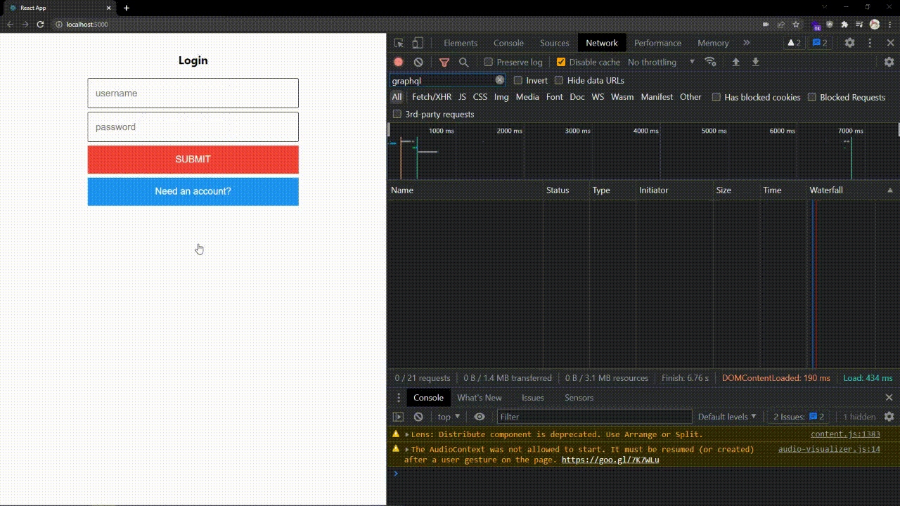

# Using GraphQL

## Table of Contents

- [Step 1 - GraphQL](#step-1---graphql)
- [Step 2 - Updating lib/auth.js](#step-2---updating-libauthjs)
- [Step 3 - Updating lib/tasks.js](#step-3---updating-libtasksjs)
- [Step 4 - Wrap Up](#step-4---wrap-up)

## Step 1 - GraphQL

So far we've handled communication with the Amplication backend by making HTTP requests. However, Amplication provides another way of interacting with the backend, GraphQL. GraphQL is a querying language that allows for readable commands with many benefits. If you want to know more about why GraphQL may be a better choice for your application I'd recommend reading [this article](https://www.apollographql.com/blog/graphql/basics/why-use-graphql/) by the Apollo team.

If you're running the backend (`npm run start:backend`) you can tinker with queries on the GraphQL Playground [http://localhost:3000/graphql](http://localhost:3000/graphql).


1. To make the GraphQL queries to the backend we'll use a library called `@apollo/client`. First, install `@apollo/client` as a dependency in the `web` subfolder:

   ```bash
   cd web
   npm install @apollo/client
   ```

2. We'll want to configure our GraphQL client. Create the following file `web/src/lib/apollo.js` and at the top of the file import `@apollo/client`.

3. Then paste in the following code:

   ```js
   import { ApolloClient, createHttpLink, InMemoryCache } from "@apollo/client";
   import { setContext } from "@apollo/client/link/context";

   const apiUrl = "http://localhost:3000/graphql";
   const jwtKey = "accessToken";

   const httpLink = createHttpLink({
     uri: apiUrl,
   });

   const authLink = setContext((_, { headers }) => {
     const token = localStorage.getItem(jwtKey);
     return {
       headers: {
         ...headers,
         authorization: token ? `Bearer ${token}` : "",
       },
     };
   });

   export const client = new ApolloClient({
     link: authLink.concat(httpLink),
     cache: new InMemoryCache(),
   });
   ```

   As in [Tutorial Step 4](../step-004), the `@apollo/client` has been configured to take the user's JWT access token and assign it to the Authorization header of every request.

4. We'll also want to include the functions that check if an access token exists and to save a new access token.

   ```js
   export const isStoredJwt = () => Boolean(localStorage.getItem(jwtKey));
   export const setStoredJwt = (accessToken) =>
     localStorage.setItem(jwtKey, accessToken);
   ```

5. Finally, we'll want to export the `gql` from the `@apollo/client`. This allows for GraphQL queries and mutations to be written.

   ```js
   export { gql } from "@apollo/client";
   ```

## Step 2 - Updating lib/auth.js

Open up `web/src/lib/auth.js` and delete all the code in the file. At the top of the file, we'll import some of the functions we created in the `web/src/lib/apollo.js` file.

```js
import { gql, isStoredJwt, setStoredJwt, client } from "./apollo";
```

1. Firstly, add the new `me` function:

   ```js
   const GET_ME = gql`
     query me {
       me {
         id
       }
     }
   `;

   export const me = async () => {
     return isStoredJwt()
       ? (await client.query({ query: GET_ME }).catch(() => null))?.data.me
       : null;
   };
   ```

   You'll notice that the query for the user account is broken up into two parts: `GET_ME` and `me`. The first variable, `GET_ME` is where the query is written. One of the benefits of GraphQL is that we tell the backend what data we want. In this case, all we need is the `id` of a user, so that's all these query requests.

   `me` will actually run the query.

2. Next, add the `login` function:

   ```js
   const LOGIN = gql`
     mutation login($credentials: Credentials!) {
       login(credentials: $credentials) {
         accessToken
       }
     }
   `;

   export const login = async (username, password) => {
     const result = (
       await client
         .mutate({
           mutation: LOGIN,
           variables: { credentials: { username, password } },
         })
         .catch(() => null)
     )?.data.login;

     if (!result) {
       return alert("Could not login");
     }
     setStoredJwt(result.accessToken);
     return me();
   };
   ```

   Now, instead of referring to this as a query, we'll call this function a mutation. Queries are used to read data, mutations are used to write data. Logging in and signing up are technically writing data, as a session is being created in the backend.

   `LOGIN` is a mutation that takes the `username` and `password` of a user as an object and returns only the `accessToken` from the request.

   `login` will execute the mutation like the HTTP implementation. Instead of sending the credentials in the BODY of an HTTP request, credentials (and other arguments in general) are passed in a `variables` object. The key values of `variables` map to the variable names in the `mutation` we write. So `variables.credentials` in `client.mutate` maps to `$credentials` in `mutation login($credentials: Credentials!)`.

3. Finally, add the `signup` function:

   ```js
   const SIGNUP = gql`
     mutation signup($credentials: Credentials!) {
       signup(credentials: $credentials) {
         accessToken
       }
     }
   `;

   export const signup = async (username, password) => {
     const result = (
       await client
         .mutate({
           mutation: SIGNUP,
           variables: { credentials: { username, password } },
         })
         .catch(() => null)
     )?.data.signup;

     if (!result) {
       return alert("Could not sign up");
     }
     setStoredJwt(result.accessToken);
     return me();
   };
   ```

## Step 3 - Updating lib/tasks.js

We'll next need to update the tasks functions to use GraphQL. Open up `web/src/lib/tasks.js` and delete all the code in the file and replace it with the following:

```js
import { gql, client } from "./apollo";

const CREATE_TASK = gql`
  mutation createTask($data: TaskCreateInput!) {
    createTask(data: $data) {
      completed
      createdAt
      id
      text
    }
  }
`;

export const create = async (text, uid) => {
  const result = (
    await client
      .mutate({
        mutation: CREATE_TASK,
        variables: {
          data: {
            completed: false,
            text,
            uid: { id: uid },
          },
        },
      })
      .catch(() => null)
  )?.data.createTask;

  if (!result) {
    return alert("Could not create task");
  }

  return result;
};

const GET_TASKS = gql`
  query tasks($where: TaskWhereInput, $orderBy: [TaskOrderByInput!]) {
    tasks(where: $where, orderBy: $orderBy) {
      completed
      createdAt
      id
      text
    }
  }
`;

export const getAll = async (uid) => {
  const result = (
    await client
      .query({
        query: GET_TASKS,
        variables: {
          where: { uid: { id: uid } },
          orderBy: { createdAt: "Asc" },
        },
      })
      .catch(() => null)
  )?.data.tasks;

  if (!result) {
    alert("Could not get tasks");
    return [];
  }

  return result;
};

const UPDATE_TASK = gql`
  mutation updateTask($data: TaskUpdateInput!, $where: TaskWhereUniqueInput!) {
    updateTask(data: $data, where: $where) {
      completed
      createdAt
      id
      text
    }
  }
`;

export const update = async (task) => {
  const result = (
    await client
      .mutate({
        mutation: UPDATE_TASK,
        variables: {
          data: {
            completed: !task.completed,
          },
          where: {
            id: task.id,
          },
        },
      })
      .catch(() => null)
  )?.data.updateTask;

  if (!result) {
    return alert("Could not update task");
  }

  return result;
};
```

## Step 4 - Wrap Up

Run the application and play around!



Users' tasks are now being saved to the Amplication backend with GraphQL queries and mutations rather than traditional HTTP requests.

Congratulations developer. Take with you what you've learned and build something amazing.

If you need help or want to share what you're up to then you should join our [Discord](https://discord.com/invite/KSJCZ24vj2).

To view the changes for this step, [visit here](https://github.com/amplication/react-todos/compare/step-005...step-006).
